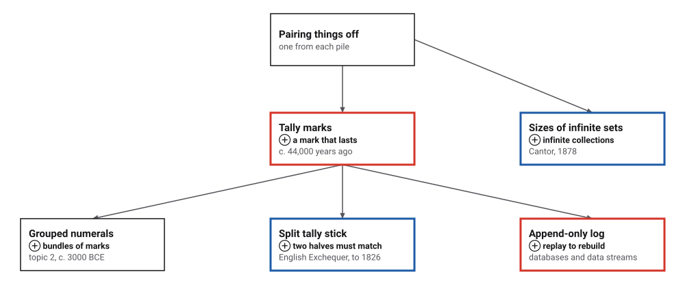
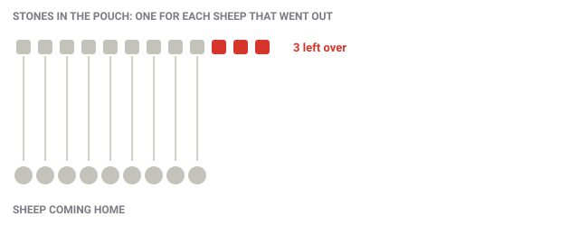
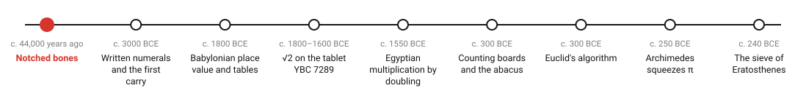
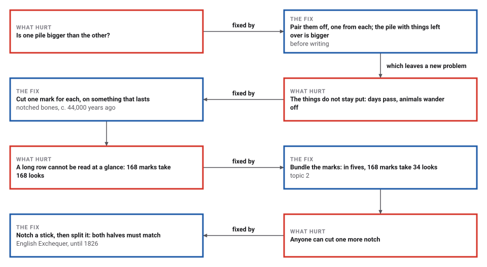
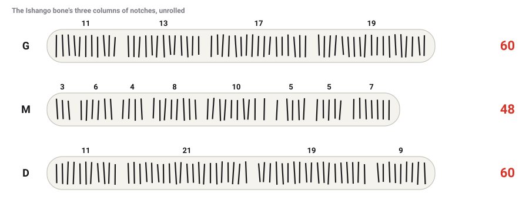
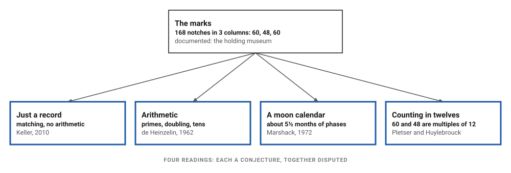
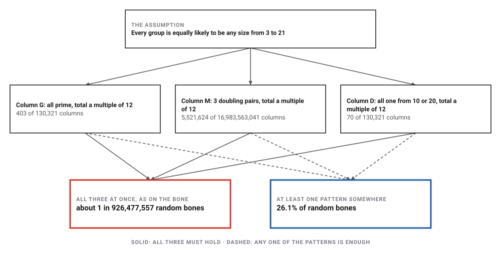
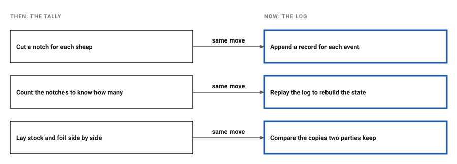

# Tally Marks

*Era 1 · topic 1 · c. 44,000–20,000 years ago* · [Era 1 index](../README.md) · [Grouping and the First Carry →](../02-grouping-and-the-first-carry/README.md) · [Interactive edition](tally-marks.html) · [Program](../../../code/era-01-the-first-algorithms/01-tally-marks/)

> **Field note from the visiting historian.** Before numbers, there is matching: one notch for each animal, each day, each debt. You need no idea of "seventeen" to keep this record; you only need to be able to make one mark per thing.

| | |
|---|---|
| **When** | Border Cave, c. 44,000 years ago · Ishango, c. 25,000–20,000 years ago by most sources (a re-evaluation cited by the UNESCO portal gives 25,000–16,000) |
| **Where** | South Africa and the DR Congo (**documented**) |
| **What hurt** | Remembering *how many* with no words for big numbers |
| **The fix** | One mark per thing, on something that lasts |
| **Cost** | One look per mark to read it back: 168 marks, 168 looks |
| **Atlas** | Ch. 7 Early Number Systems · Ch. 89 Numeral Systems |

## How ideas combined

A new algorithm is usually an older idea combined with a new one. The tally is the oldest entry in this book, so it starts with something even older: pairing things off. Each box names the idea that was added.

<picture>
  <source media="(prefers-color-scheme: dark)" srcset="assets/family-dark.svg">
  
</picture>
*Red: the tally and its most direct descendant today. Blue: refinements that kept the core idea, one mark for one thing.*

## Which is more, with no numbers at all?

A herder drops a stone into a pouch for each sheep that goes out to graze. In the evening, each sheep that comes home takes one stone back out. Stones left in the pouch mean sheep still out. The herder needs no word for *twelve*: only the pairing.

<picture>
  <source media="(prefers-color-scheme: dark)" srcset="assets/match-dark.svg">
  
</picture>
*In the interactive edition the sheep come home one at a time, and you can try another day.*

The program pairs off **200,000** random pairs of collections and checks the answer against counting: they agree every time. For 12 stones and 9 sheep it makes 9 pairs and finds 3 left over, where counting both would take 21 counts. The story of the herder is an illustration, not a historical record.

> **Key idea.** Two collections are the same size when their things can be paired off with none left over. Georg Cantor made exactly this the definition of *same size* (1878). With it, some infinite sets turn out to be bigger than others: the real numbers cannot be paired off with the whole numbers, as he had shown in 1874.

## Era 1, the first algorithms

<picture>
  <source media="(prefers-color-scheme: dark)" srcset="assets/era-timeline-dark.svg">
  
</picture>

## Each fix leaves a new pain

<picture>
  <source media="(prefers-color-scheme: dark)" srcset="assets/chain-dark.svg">
  
</picture>
*Read it as a snake: each new problem sits directly under the fix that exposed it.*

Why is a long tally hard to read? People can see how many things are in a small group at a glance, but past a handful they have to count one by one. Psychologists named the glance *subitizing* in 1949; studies put its limit somewhere between about 3 and 6 things. So a tally costs one look per mark to read back, and bundling the marks cuts that down:

| Marks | Looks, one by one | Looks, in bundles of five |
|---|---|---|
| 4 | 4 | 1 |
| 7 | 7 | 2 |
| 23 | 23 | 5 |
| 60 | 60 | 12 |
| **168** | **168** | **34** |
| 1,000 | 1,000 | 200 |

One look per bundle, plus one for the leftover marks. The model is deliberately simple, and the bundles are the subject of topic 2.

## The Ishango bone, notch by notch

The best-known notched bone was excavated in 1950 at Ishango, in what is now the Democratic Republic of the Congo. It is a fossilised bone handle with a quartz tip, and it carries **168 notches** in three columns. The museum that holds it says it is still not clear what the marks represent. The group sizes below are those read by Jean de Heinzelin, who first proposed an arithmetic reading in 1962, as listed by the UNESCO astronomy portal. The readings scholars have proposed follow; in the interactive edition you can switch between them.

<picture>
  <source media="(prefers-color-scheme: dark)" srcset="assets/ishango-dark.svg">
  
</picture>
*In the interactive edition you can switch between the readings: primes, tens, doubling, totals, and a different grouping.*

| Column | Groups (de Heinzelin's reading) | Total | All prime? | All 10 ± 1 or 20 ± 1? | Doubling pairs |
|---|---|---|---|---|---|
| G | 11, 13, 17, 19 | 60 | yes | no | 0 |
| M | 3, 6, 4, 8, 10, 5, 5, 7 | 48 | no | no | 3 |
| D | 11, 21, 19, 9 | 60 | no | yes | 0 |

> **Wrong turn.** Group the same marks differently and the pattern changes. The UNESCO portal's listing writes two of column M's groups as 9 + 1 and 1 + 4. Split them (3, 6, 4, 8, 9, 1, 1, 4, 5, 7) and the total is still 48, but the doubling pairs fall from 3 to **2**. Where a group ends is itself a judgement, and NRICH's version of the same column groups it differently again.

<picture>
  <source media="(prefers-color-scheme: dark)" srcset="assets/readings-dark.svg">
  
</picture>
*Each reading is a conjecture; together they are disputed. Keller's sceptical analysis argues the marks show nothing beyond one-to-one matching.*

## How surprising are the patterns?

Suppose the carver had cut groups of random sizes. How often would random groups show the bone's patterns? The program counts every possible column exactly, under one stated assumption: each group is equally likely to be any size from 3 to 21, the range of the bone's main groups.

<picture>
  <source media="(prefers-color-scheme: dark)" srcset="assets/surprise-dark.svg">
  
</picture>

> **Careful.** Both numbers are honest, and they pull in opposite directions. The combination is rare (about 1 in 926,477,557), which suggests the groups were not cut at random. But the patterns were chosen *after* looking at the bone. Any particular set of numbers is rare, and a reader who checks enough patterns will find one: under the same assumption, **26.1%** of random bones show at least one of these patterns somewhere. Rare is not the same as meaningful.

<details>
<summary>Show the counts</summary>

| Pattern | Columns showing it | Columns possible |
|---|---|---|
| all prime and total multiple of 12 | 403 | 130,321 |
| near ten and total multiple of 12 | 70 | 130,321 |
| both of those | 6 | 130,321 |
| three doublings and total multiple of 12 | 5,521,624 | 16,983,563,041 |

</details>

## The tally became the log

A tally is only ever added to; the count is its length. Modern systems keep their most important records the same way. In 2013 Jay Kreps, one of the creators of the Kafka messaging system at LinkedIn, defined a log as "an append-only, totally-ordered sequence of records ordered by time": a tally of events. A database writes each change to such a log before applying it; in his words, "the log is the record of what happened", and every table is rebuilt from it after a crash.

<picture>
  <source media="(prefers-color-scheme: dark)" srcset="assets/circle-dark.svg">
  
</picture>

> **Full circle.** The English Exchequer kept accounts on split tally sticks until 1826. Burning the old sticks in the Palace's furnaces led to the great fire of 16 October 1834 at the Palace of Westminster. The program checks the split-tally idea: 10,000 honest stick pairs matched, and **10,000 of 10,000** forged halves were caught.

## Before you read on

<details>
<summary><b>1.</b> Without counting, how can a herder tell that sheep are missing?</summary>

Pair each returning sheep with a stone from the pouch. For 12 stones and 9 sheep: **9 pairs, 3 stones left over**, so 3 sheep are still out. Counting both would take 21 counts.
</details>

<details>
<summary><b>2.</b> Add up column G: 11 + 13 + 17 + 19.</summary>

**60**. Column D also totals 60, and column M 48: 168 notches in all.
</details>

<details>
<summary><b>3.</b> How many looks does a tally of 168 marks take, one by one and in bundles of five?</summary>

**168** one by one; **34** in fives (33 full bundles and one look for the 3 left over).
</details>

<details>
<summary><b>4.</b> Why can't the holder of one half of a split tally add a notch?</summary>

The notches were cut across the whole stick before it was split, so the other half would no longer line up. The program forged 10,000 halves and caught **10,000**.
</details>

<details>
<summary><b>5.</b> The bone's patterns, all at once, would appear about once in 926,477,557 random bones. Does that prove the carver knew about primes?</summary>

No. The patterns were picked after looking at the bone, and any particular set of numbers is rare. With several patterns to check, 26.1% of random bones show at least one. The calculation also assumes group sizes are equally likely from 3 to 21, and that de Heinzelin's groups are the right ones.
</details>


## Where the evidence lives

| | Object | Where to see it | Licence |
|---|---|---|---|
| — | **The Ishango bone**. A bone handle with a quartz tip and 168 notches, excavated in 1950; about 25,000 to 20,000 years old by most sources, 25,000 to 16,000 by a re-evaluation cited by the UNESCO portal. Royal Belgian Institute of Natural Sciences, Brussels. | [The museum's page](https://ishango.naturalsciences.be/en/en-ishango-20.html) | Drawn placeholder; the museum's photographs are at the link. |
| — | **Notched bones from Border Cave**. South Africa, about 44,000 years old. The excavators conclude that people there "used notched bones for notational purposes" (d'Errico et al., PNAS 2012). | [The paper's Europe PMC record](https://www.ebi.ac.uk/europepmc/webservices/rest/search?query=DOI:10.1073/pnas.1204213109&format=json&resultType=core) | Drawn placeholder. |
| — | **Medieval Exchequer tally sticks**. London, about 1440. Science Museum Group, object 1952-431. The lender kept the stock, the debtor the foil. | [Science Museum Group record](https://collection.sciencemuseumgroup.org.uk/objects/co60506/medieval-exchequer-tally-sticks) | Drawn placeholder. The museum's photograph is CC BY-NC-SA 4.0, so it is linked, not copied. |

## Every link was opened before it was listed

| Level | Link | Why |
|---|---|---|
| Start | [A brief history of numerical systems](https://www.youtube.com/watch?v=cZH0YnFpjwU) — TED-Ed (Alessandra King) | Short animation from body-part counting and tally marks to Egyptian and Babylonian numerals |
| Start | [Ishango Bone](https://humanorigins.si.edu/evidence/behavior/recording-information/ishango-bone) — Smithsonian Human Origins | Short museum entry: age, discovery, three rows of tally marks |
| Start | [Ishango Bone](https://nrich.maths.org/problems/ishango-bone) — NRICH, University of Cambridge | Student activity listing the notch groups row by row; stresses that "nobody knows for sure" |
| Start | [When was math invented?](https://www.livescience.com/physics-mathematics/mathematics/when-was-math-invented) — Live Science (2025) | Lebombo to Ishango to Sumerian numerals, with expert caution about origins |
| Deeper | [Lecture 2: Arithmetic (handout)](https://people.math.harvard.edu/~knill/teaching/mathe320_2010/handouts/01-arithmetic.pdf) — Harvard Math E-320, Oliver Knill | Written lecture notes: tallying with sticks, bones, knots and pebbles, through to Egyptian and Babylonian numerals |
| Deeper | [Technical Marvels (2): Lebombo and Ishango Bones](https://cacm.acm.org/blogcacm/technical-marvels-part-2-lebombo-and-ishango-bones) — Communications of the ACM blog | A computing historian on both bones as early notation |
| Deeper | [The Ishango Bone, DR Congo](https://web.astronomicalheritage.net/show-entity?identity=85&idsubentity=1) — UNESCO Portal to the Heritage of Astronomy | Column totals 60, 48, 60, with the counting and lunar readings side by side |
| Deeper | [Georg Cantor](https://mathshistory.st-andrews.ac.uk/Biographies/Cantor/) — MacTutor | 1874: the reals cannot be counted; 1878: sets of equal power are those in one-to-one correspondence |
| Scholar | [The first Ishango bone](https://ishango.naturalsciences.be/en/en-ishango-20.html) — RBINS, the holding museum | The museum's own description and its caution about interpretation |
| Scholar | [The fables of Ishango, or the irresistible temptation of mathematical fiction](http://www.bibnum.education.fr/sites/default/files/ishango-analysis_v2.pdf) — Olivier Keller (2010; English 2015) | The main sceptical analysis |
| Scholar | [Does the Ishango Bone Indicate Knowledge of the Base 12?](https://arxiv.org/pdf/1204.1019) — Vladimir Pletser, arXiv | The base-12 reading. Read it alongside Keller |
| Scholar | [The oldest mathematical artefact](https://www.cambridge.org/core/journals/mathematical-gazette/article/abs/7136-the-oldest-mathematical-artefact/65E17776F7EC0D23568F9826F5BC8CDF) — Mathematical Gazette 71 (1987) | The note that named the Lebombo bone the oldest mathematical artefact (preview only) |
| Start | [Tally sticks](https://www.parliament.uk/about/living-heritage/building/palace/estatehistory/from-the-parliamentary-collections/fire-of-westminster/tallysticks/) — UK Parliament | Abolished in 1826; burning them caused the fire of 16 October 1834 |
| Start | [Medieval Exchequer tally sticks](https://collection.sciencemuseumgroup.org.uk/objects/co60506/medieval-exchequer-tally-sticks) — Science Museum Group | A real pair, c. 1440: stock for the lender, foil for the debtor |
| Deeper | [The Log: What every software engineer should know about real-time data's unifying abstraction](https://engineering.linkedin.com/distributed-systems/log-what-every-software-engineer-should-know-about-real-time-datas-unifying) — Jay Kreps, LinkedIn Engineering (2013) | The append-only log as the core of modern data systems |
| Scholar | [Subitizing: An Analysis of Its Component Processes](https://escholarship.org/content/qt9fn27772/qt9fn27772_noSplash_758e0f7f6e6c0393e6eb156f48bd67b2.pdf) — Mandler and Shebo, J. Exp. Psychology: General (1982) | Why small groups are seen at a glance and long rows must be counted |

More, with certainty labels and the gaps we could not fill: [Era 1 reference catalog](https://github.com/vij658/AlgorithmEvolutionAtlas/blob/main/book/era-01-the-first-algorithms/reference-catalog.md).

## The program behind every number here

[TallyMarks.java](https://github.com/vij658/AlgorithmEvolutionAtlas/blob/main/code/era-01-the-first-algorithms/01-tally-marks/TallyMarks.java) makes **210,029 checks**: matching against counting on 200,000 random pairs, the Ishango column arithmetic, the counting programme against brute force, and 10,000 honest and 10,000 forged split tallies. Run it with `java TallyMarks.java` (JDK 17 or newer). The heart of it:

```java
/**
 * Pair the two collections off one thing at a time until one of them runs out. No number is ever needed: each step
 * only asks "is there still something on both sides?". The copies are taken so the caller's lists are untouched.
 */
static <T> Match match(List<T> first, List<T> second) {
    Deque<T> a = new ArrayDeque<>(first), b = new ArrayDeque<>(second);
    int pairs = 0;
    while (!a.isEmpty() && !b.isEmpty()) {             // one stone from each pile, set aside together
        a.pop();
        b.pop();
        pairs++;
    }
    if (a.isEmpty() && b.isEmpty()) return new Match(pairs, 0, 0);
    return a.isEmpty() ? new Match(pairs, 2, b.size()) : new Match(pairs, 1, a.size());
}

/** Neighbouring groups where one is exactly twice the other. */
static int doublingPairs(int[] col) {
    int k = 0;
    for (int i = 0; i + 1 < col.length; i++)
        if (col[i] == 2 * col[i + 1] || col[i + 1] == 2 * col[i]) k++;
    return k;
}
```

