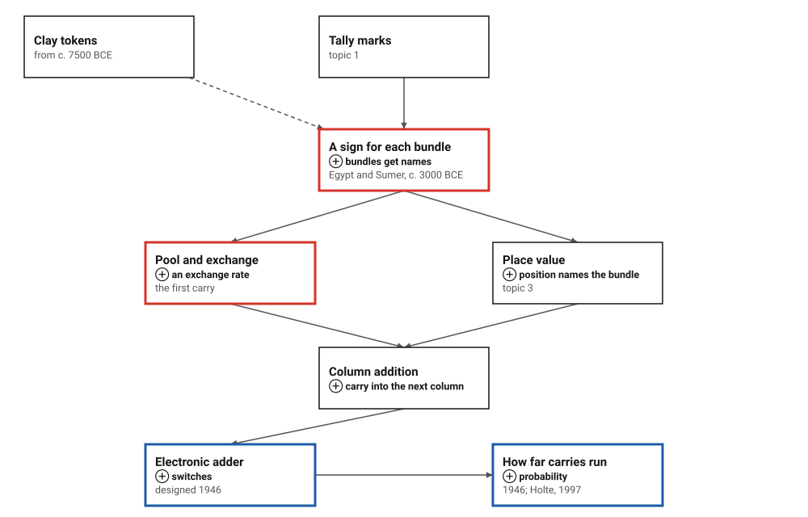
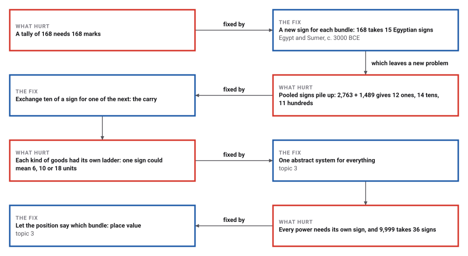
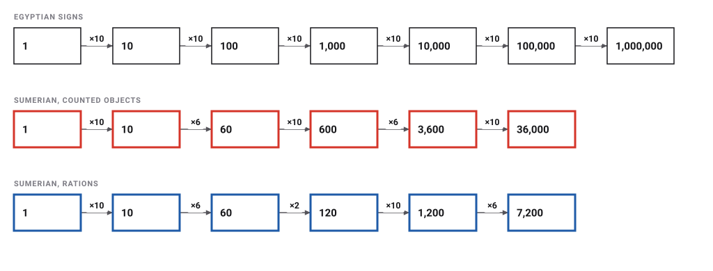
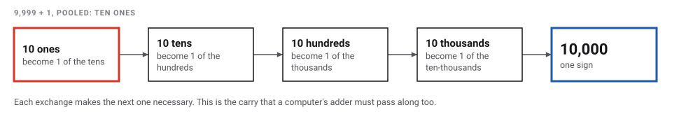
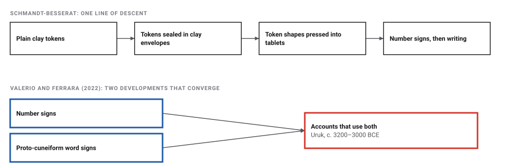
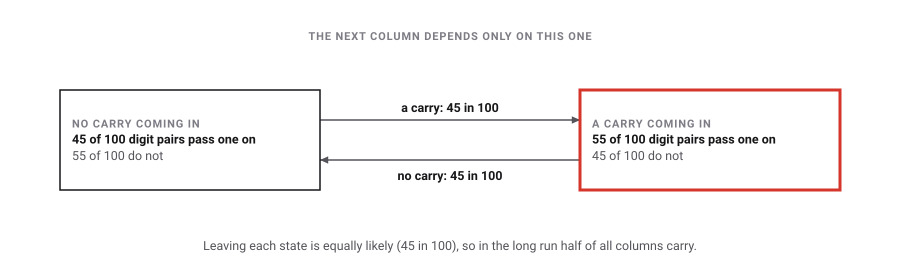

# Grouping and the First Carry

*Era 1 · topic 2 · c. 3200–3000 BCE* · [Era 1 index](../README.md) · [← Tally Marks](../01-tally-marks/README.md) · [Babylonian Place Value →](../03-babylonian-place-value/README.md) · [Interactive edition](grouping-and-the-first-carry.html) · [Program](../../../code/era-01-the-first-algorithms/02-grouping-and-the-first-carry/)

> **Field note from the visiting historian.** Fourteen strokes in a row cannot be read at a glance; ten strokes swapped for one new sign can. Once the signs exist, adding is pooling them, and whenever too many of one sign pile up you exchange them for one of the next.

| | |
|---|---|
| **When** | Uruk accounts c. 3200–3000 BCE · Egyptian numerals from c. 3000 BCE (**documented**) |
| **Where** | Mesopotamia and Egypt |
| **What hurt** | Long rows of marks are slow to write and impossible to read at a glance |
| **The fix** | A sign for each bundle; add by pooling and exchanging |
| **Cost** | 168 takes 15 Egyptian signs instead of 168 marks |
| **Atlas** | Ch. 7.1 Computational limits of additive numerals · Ch. 89 Numeral Systems |

## How ideas combined

A new algorithm is usually an older idea combined with a new one. Here the tally (topic 1) gains names for its bundles, and adding gains its first rule: the exchange. Each box names the idea that was added.

<picture>
  <source media="(prefers-color-scheme: dark)" srcset="assets/family-dark.svg">
  
</picture>
*Red: grouped signs and the carry they made necessary. Blue: where the carry went in the twentieth century. The dashed arrow from tokens is disputed (see below).*

## Pool the signs, then exchange

Write each number with its signs. To add, put the two piles together, then wherever there are too many of one sign, swap them for one sign of the next size. In Egyptian signs the rate is always ten; in the oldest Sumerian accounts it is mostly ten and six (the rations ladder also has a step of two).

<picture>
  <source media="(prefers-color-scheme: dark)" srcset="assets/pool-dark.svg">
  
</picture>
*In the interactive edition you can pool and exchange your own numbers, in Egyptian or Sumerian signs.*

The signs are simplified drawings made for this book. MacTutor puts the rule in one sentence: "One just adds the individual symbols, but replacing ten copies of a symbol by a single symbol of the next higher value."

## Era 1, the first algorithms

<picture>
  <source media="(prefers-color-scheme: dark)" srcset="assets/era-timeline-dark.svg">
  
</picture>

## Each fix leaves a new pain

<picture>
  <source media="(prefers-color-scheme: dark)" srcset="assets/chain-dark.svg">
  
</picture>
*Read it as a snake: each new problem sits directly under the fix that exposed it.*

Signs for bundles shrink the writing dramatically. The program counts the signs each system needs:

| Number | Tally marks | Egyptian signs | Sumerian signs (counted objects) |
|---|---|---|---|
| 7 | 7 | 7 | 7 |
| 60 | 60 | 6 | 1 |
| **168** | **168** | **15** | **14** |
| 1,999 | 1,999 | 28 | 16 |
| 4,622 | 4,622 | 14 | 11 |
| 9,999 | 9,999 | 36 | 24 |
| average, 1 to 9,999 | 5,000.0 | 18.00 | 14.67 |

The worst number below 10,000 is 9,999 for Egyptian signs (36 signs) and 7,199 for the Sumerian ones (29). More rungs on the ladder mean fewer signs per number, but more kinds of sign to learn.

## 2,763 + 1,489, by exchange

| Step | Thousands | Hundreds | Tens | Ones | What happened |
|---|---|---|---|---|---|
| **0** | **3** | **11** | **14** | **12** | **Pool the signs of both numbers** |
| 1 | 3 | 11 | 15 | 2 | Ten ones out, one of the tens in |
| 2 | 3 | 12 | 5 | 2 | Ten tens out, one of the hundreds in |
| 3 | 4 | 2 | 5 | 2 | Ten hundreds out, one of the thousands in |

Result: **4,252**, after **3 exchanges**. The Sumerian ladder works the same way with a different rate at each step. 47 + 38 counted objects:

| Step | Sixties | Tens | Ones | What happened |
|---|---|---|---|---|
| **0** | **0** | **7** | **15** | **Pool the signs** |
| 1 | 0 | 8 | 5 | Ten small cones out, one small circle in |
| 2 | 1 | 2 | 5 | Six small circles out, one large cone in |

Result: **85** = 1 sixty, 2 tens and 5 ones, after 2 exchanges. Nothing in the method needs ten: only an agreed rate for each step.

<picture>
  <source media="(prefers-color-scheme: dark)" srcset="assets/ladders-dark.svg">
  
</picture>
*The Sumerian ladders follow Duncan Melville's account: the counted-objects system reaches 36,000 units and the rations system 7,200. The same sign could mean different amounts in different systems.*

> **Key idea.** An exchange can trigger the next one. In 9,999 + 1 the ten ones become a ten, which makes ten tens, which makes ten hundreds, and so on. One added stroke forces four exchanges:

<picture>
  <source media="(prefers-color-scheme: dark)" srcset="assets/cascade-dark.svg">
  
</picture>

## Where did written numbers come from?

Denise Schmandt-Besserat's account runs in one line: plain clay tokens (about 7500 to 3500 BCE), then tokens sealed in clay envelopes, then tablets with impressed signs, then abstract numerals. Valerio and Ferrara (2022) argue instead that numerals and proto-cuneiform signs were "two distinct but converging developments". **Disputed**.

<picture>
  <source media="(prefers-color-scheme: dark)" srcset="assets/debate-dark.svg">
  
</picture>
*The token account is widely taught; the critique is recent. Both agree that by about 3200–3000 BCE the accounts of Uruk wrote numbers with bundled signs (**documented**).*

## How often does a carry happen?

Add two long random numbers. How many columns pass a carry on? The program added 200,000 pairs of 12-digit numbers. In the first column 45 of the 100 possible digit pairs make a carry, so it carries 45% of the time (0.4480 in the program's random sample). Further along, a carry coming in makes the next carry more likely:

<picture>
  <source media="(prefers-color-scheme: dark)" srcset="assets/markov-dark.svg">
  
</picture>

| What was measured | Share of columns that carry |
|---|---|
| First column (no carry can come in) | 0.4480 |
| All 12 columns | 0.4948 |
| Columns 21 to 40 of 40-digit numbers | **0.5000** |

John Holte proved in 1997 that the long-run share is exactly one half, and that the carries form a Markov chain: the chance of the next carry depends only on whether this column carried.

## The carry inside the computer

In 1946 Arthur Burks, Herman Goldstine and John von Neumann wrote the design of a stored-program computer that worked in binary, with 40-digit numbers. For its adder they worked out how far a carry travels. Their answer: the longest carry chain averages no more than log₂ 40 (the power of 2 that gives 40), about 5.3 places, "an average length of about 5 for the longest carry sequence".

> **Full circle.** The program added 200,000 pairs of random 40-bit numbers. The longest carry chain averaged **4.609** places (their bound: 5.322). The most common longest chain was 4, the longest seen 21, against a worst case of 40. Five thousand years after the first exchange of ten strokes for one sign, how far a carry travels had become a question about how fast a computer can add.

## Before you read on

<details>
<summary><b>1.</b> How many Egyptian signs does 1,999 need? How many tally marks?</summary>

**28** signs (1 thousand, 9 hundreds, 9 tens, 9 ones) against **1,999** marks. In the Sumerian counted-objects system it takes 16.
</details>

<details>
<summary><b>2.</b> Add 2,763 + 1,489 in Egyptian signs. How many exchanges?</summary>

Pooled: 12 ones, 14 tens, 11 hundreds, 3 thousands. Exchanging gives **4,252** in **3** exchanges.
</details>

<details>
<summary><b>3.</b> Why can adding two numbers in Egyptian signs never need two exchanges in the same column?</summary>

Each number has at most 9 of a sign, so the pool has at most 9 + 9 = 18, plus 1 carried in: 19. That is less than 20, so one exchange always clears the column.
</details>

<details>
<summary><b>4.</b> In the Sumerian counted-objects system, how many units is the sign after 600 worth?</summary>

**3,600**: 600 × 6. The ladder is 1, 10, 60, 600, 3,600, 36,000.
</details>

<details>
<summary><b>5.</b> If half of all columns carry in the long run, why does the first column carry less often?</summary>

Nothing can carry into the first column. Without a carry coming in, only 45 of the 100 digit pairs reach ten; with one, 55 do.
</details>


## Where the evidence lives

| | Object | Where to see it | Licence |
|---|---|---|---|
|  | **Proto-cuneiform tablet, account of barley**. Jemdet Nasr period, c. 3100–2900 BCE. The round and conical impressions are numbers. Metropolitan Museum of Art, 1988.433.1. | [The Met's record](https://www.metmuseum.org/art/collection/search/329081) | Photo: The Metropolitan Museum of Art, Open Access, public domain. |
| — | **Clay envelope with tokens, Susa**. A hollow clay ball (bulla) that held tokens, with impressions on its surface. Musée du Louvre, SB 1967. | [The Louvre's record](https://collections.louvre.fr/en/ark:/53355/cl010176019) | Drawn placeholder; the museum's photographs are at the link. |

## Every link was opened before it was listed

| Level | Link | Why |
|---|---|---|
| Start | [Cuneiform Numbers](https://www.youtube.com/watch?v=RR3zzQP3bII) — Numberphile (Alex Bellos) | How numbers were written in cuneiform |
| Start | [Egyptian Number System](https://www.youtube.com/watch?v=z8f4MR6m7YY) — Khan Academy India | The hieroglyphic signs for powers of ten |
| Start | [Arithmetic Operations in Egyptian Number System](https://www.youtube.com/watch?v=YdOXWQuNsDE) — Khan Academy India | Adding with Egyptian numerals: the pool-and-exchange carry |
| Start | [The most important lumps of dry mud in history](https://www.youtube.com/watch?v=BLHhcYFeC5A) — Stefan Milo | Clay tokens as counters that became writing (does not mention the critiques) |
| Deeper | [From Laundry Lists to Liturgies: The Origins of Writing in Ancient Mesopotamia](https://www.youtube.com/watch?v=Rgdb-sY0Y4A) — Getty Museum, Irving Finkel (British Museum) | 90-minute talk on how cuneiform began, accounting included |
| Deeper | [Denise Schmandt-Besserat — How Writing Came About](https://www.youtube.com/watch?v=M7bg0PsNXMQ) — Talk by the author of the token theory | The theory in her own words; pair it with Valerio and Ferrara |
| Deeper | [Number Systems Ancient to Modern 1: the Egyptians](https://www.youtube.com/watch?v=NgNNkUewUGQ) — Insights into Mathematics, N. J. Wildberger (UNSW) | Long lecture on the Egyptian system |
| Deeper | [Tokens: their significance for the origin of counting and writing](https://sites.utexas.edu/dsb/tokens/tokens/) — Denise Schmandt-Besserat, UT Austin | The token sequence with dates |
| Scholar | [Bulla with impressions and tokens (SB 1967)](https://collections.louvre.fr/en/ark:/53355/cl010176019) — Musée du Louvre | A real clay envelope from Susa holding 15 tokens |
| Scholar | [Proto-cuneiform tablet: account of barley distribution](https://www.metmuseum.org/art/collection/search/329081) — Metropolitan Museum of Art | Jemdet Nasr tablet, c. 3100–2900 BCE, with circular impressions used as numbers |
| Scholar | [Numeracy at the dawn of writing: Mesopotamia and beyond](https://www.sciencedirect.com/science/article/pii/S0315086020300665) — Valerio and Ferrara, Historia Mathematica 59 (2022) | The critique of the token theory |
| Scholar | [The state of decipherment of proto-Elamite](https://www.mpiwg-berlin.mpg.de/Preprints/P183.PDF) — Robert K. Englund, MPIWG Preprint 183 | Proto-cuneiform number systems and their link to tokens |
| Deeper | [Carries, Combinatorics, and an Amazing Matrix](https://sites.math.washington.edu/~billey/classes/561.fall.2019/past.articles/holte.pdf) — John M. Holte, American Mathematical Monthly 104 (1997) | Carries form a Markov chain; in the long run half the columns carry |
| Scholar | [Preliminary discussion of the logical design of an electronic computing instrument](https://www.cs.unc.edu/~adyilie/comp265/vonNeumann.html) — Burks, Goldstine and von Neumann (1946) | Section 5.6: the longest carry sequence averages about 5 for 40 digits |
| Scholar | [Carries, Shuffling and An Amazing Matrix](https://ar5iv.labs.arxiv.org/html/0806.3583) — Diaconis and Fulman (2008), arXiv | Where Holte's carries chain leads: card shuffling and Eulerian numbers |

More, with certainty labels and the gaps we could not fill: [Era 1 reference catalog](https://github.com/vij658/AlgorithmEvolutionAtlas/blob/main/book/era-01-the-first-algorithms/reference-catalog.md).

## The program behind every number here

[GroupingAndCarry.java](https://github.com/vij658/AlgorithmEvolutionAtlas/blob/main/code/era-01-the-first-algorithms/02-grouping-and-the-first-carry/GroupingAndCarry.java) makes **6,000,027 checks**: pool-and-exchange against ordinary addition on 300,000 random pairs in three systems, the ladders against Melville's totals, and every binary carry against the machine's own addition. Run it with `java GroupingAndCarry.java` (JDK 17 or newer). The heart of it:

```java
/**
 * Add two numbers written in signs. Pool them (add the counts sign by sign), then walk from the smallest sign
 * upwards: while there are at least `rate` of a sign, take that many away and add one of the next sign.
 */
static Sum add(NumberSystem s, int[] a, int[] b, boolean keepStates) {
    int[] c = new int[a.length];
    for (int i = 0; i < c.length; i++) c[i] = a[i] + b[i];            // pool
    List<int[]> states = new ArrayList<>();
    if (keepStates) states.add(c.clone());
    int exchanges = 0;
    for (int i = 0; i < s.rates().length; i++) {
        while (c[i] >= s.rates()[i]) {                                // too many of this sign
            c[i] -= s.rates()[i];                                     // give up `rate` of them ...
            c[i + 1] += 1;                                            // ... for one of the next size: the carry
            exchanges++;
            if (keepStates) states.add(c.clone());
        }
    }
    return new Sum(c, exchanges, states);
}
```

