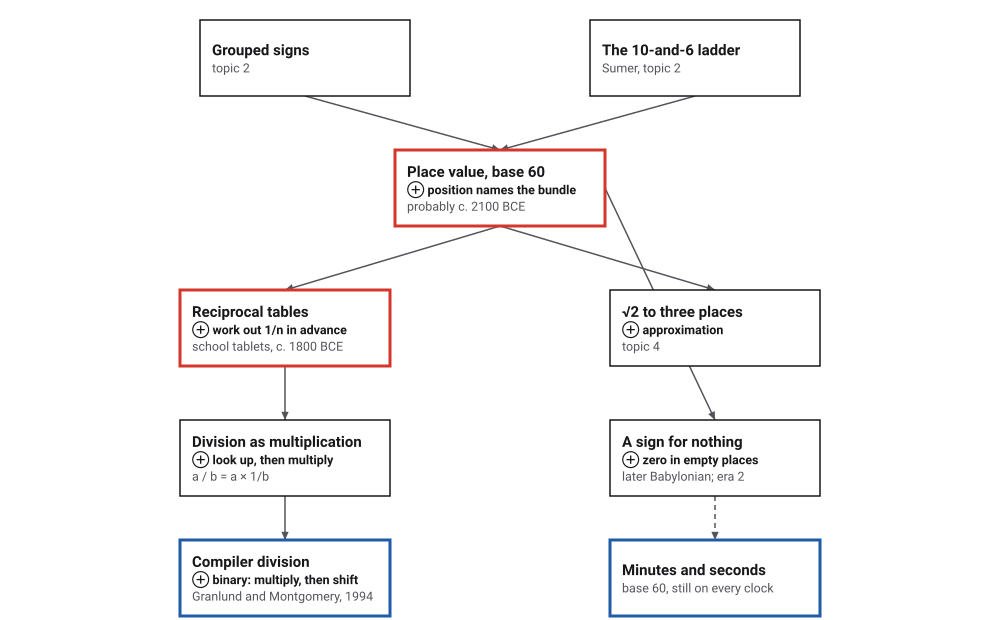
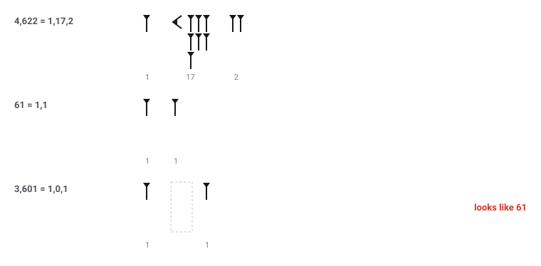
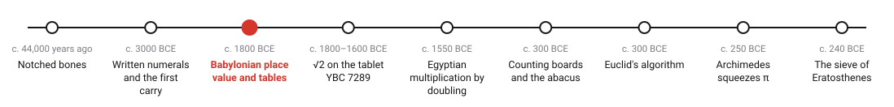
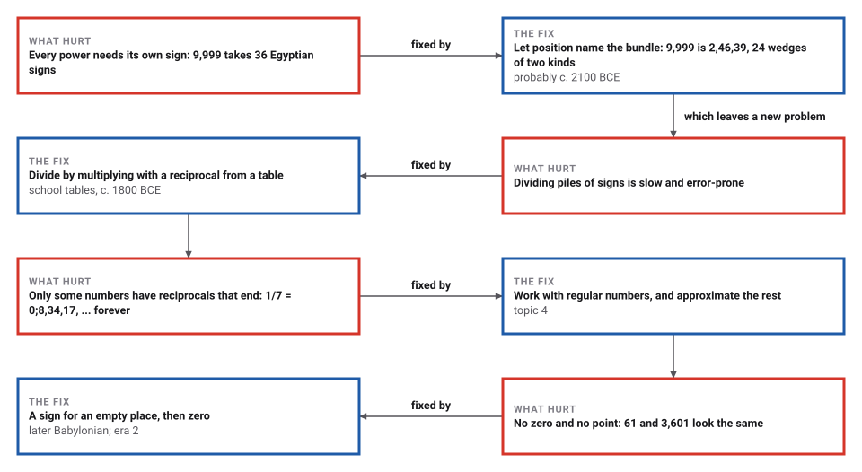
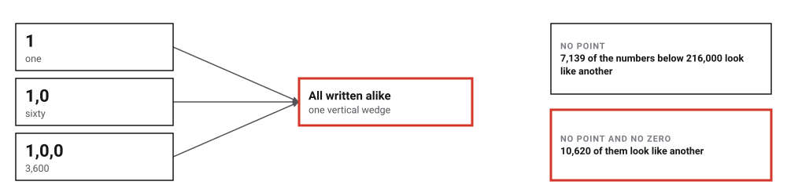
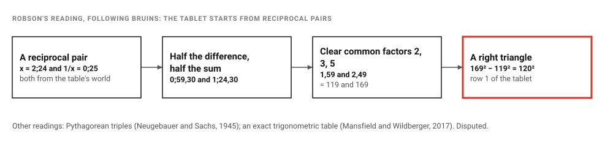
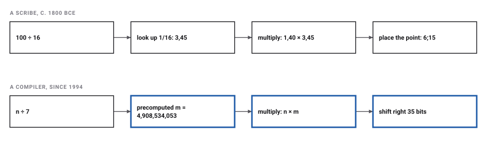

# Babylonian Place Value

*Era 1 · topic 3 · c. 2100–1800 BCE* · [Era 1 index](../README.md) · [← Grouping and the First Carry](../02-grouping-and-the-first-carry/README.md) · [The Square Root of Two →](../04-square-root-of-two/README.md) · [Interactive edition](babylonian-place-value.html) · [Program](../../../code/era-01-the-first-algorithms/03-babylonian-place-value/)

> **Field note from the visiting historian.** Position does the work that new signs did before. With position comes the first precomputed table I have found: division turns into a lookup and a multiplication.

| | |
|---|---|
| **When** | Place value probably by c. 2100 BCE (Ur III) · school tables c. 1800 BCE (**documented**) |
| **Where** | Mesopotamia |
| **What hurt** | In additive numerals, multiplying and dividing means juggling piles of signs |
| **The fix** | Base-60 place value with two signs, and tables of reciprocals |
| **Cost** | 9,999 is 2,46,39: 24 wedges of 2 kinds, against 36 Egyptian signs |
| **Atlas** | Ch. 1.2 Clay-tablet procedures · 1.3 Lookup tables · 1.5 Plimpton 322 |

## How ideas combined

A new algorithm is usually an older idea combined with a new one. Here the grouped signs of topic 2 meet the Sumerian ladder of tens and sixes, and position takes over the work that new signs did before. Each box names the idea that was added.

<picture>
  <source media="(prefers-color-scheme: dark)" srcset="assets/family-dark.svg">
  
</picture>
*Red: place value and the tables it made possible. Blue: where the ideas live in 2026. The dashed arrow is survival rather than descent: base 60 lives on in clocks and angles.*

## Two signs, sixty digits

A Babylonian number is a row of base-60 digits. Each digit is written with two signs only: a corner wedge for each ten and a vertical wedge for each one. Type a number, then switch off the empty places, as an Old Babylonian scribe would have written it.

<picture>
  <source media="(prefers-color-scheme: dark)" srcset="assets/wedges-dark.svg">
  
</picture>
*In the interactive edition you can type any number and see which others look the same.*

The wedges are simplified drawings. Two signs suffice for any number, and the average number below 10,000 needs **14.67** wedges against 18.00 Egyptian signs.

## Era 1, the first algorithms

<picture>
  <source media="(prefers-color-scheme: dark)" srcset="assets/era-timeline-dark.svg">
  
</picture>

## Each fix leaves a new pain

<picture>
  <source media="(prefers-color-scheme: dark)" srcset="assets/chain-dark.svg">
  
</picture>
*Read it as a snake: each new problem sits directly under the fix that exposed it.*

<picture>
  <source media="(prefers-color-scheme: dark)" srcset="assets/lookalike-dark.svg">
  
</picture>
*MacTutor: "The numbers 1 and 1,0, namely 1 and 60 in decimals, had exactly the same representation." The counts are for the 215,999 numbers from 1 to 215,999.*

## Divide by looking up

"For Old Babylonians, division by n amounted to multiplication by 1/n" (AMS Feature Column). Pick a divisor in the standard reciprocal table, or type any number:

| Number | In decimal | Reciprocal | Number | In decimal | Reciprocal |
|---|---|---|---|---|---|
| 2 | 2 | 30 | 27 | 27 | 2,13,20 |
| 3 | 3 | 20 | 30 | 30 | 2 |
| 4 | 4 | 15 | 32 | 32 | 1,52,30 |
| 5 | 5 | 12 | 36 | 36 | 1,40 |
| 6 | 6 | 10 | 40 | 40 | 1,30 |
| 8 | 8 | 7,30 | 45 | 45 | 1,20 |
| 9 | 9 | 6,40 | 48 | 48 | 1,15 |
| 10 | 10 | 6 | 50 | 50 | 1,12 |
| 12 | 12 | 5 | 54 | 54 | 1,6,40 |
| 15 | 15 | 4 | 1 | 60 | 1 |
| 16 | 16 | 3,45 | 1,4 | 64 | 56,15 |
| 18 | 18 | 3,20 | 1,12 | 72 | 50 |
| 20 | 20 | 3 | 1,15 | 75 | 48 |
| 24 | 24 | 2,30 | 1,20 | 80 | 45 |
| 25 | 25 | 2,24 | 1,21 | 81 | 44,26,40 |
*In the interactive edition you can divide any two numbers with the table.*

| Division | Reciprocal of the divisor | Multiply | Result (base 60) | Decimal |
|---|---|---|---|---|
| 100 ÷ 16 | 3,45 | 1,40 × 3,45 | **6;15** | 6.25 |
| 50 ÷ 8 | 7,30 | 50 × 7,30 | **6;15** | 6.25 |
| 7 ÷ 12 | 5 | 7 × 5 | **0;35** | 0.58333333... never ends |
| 1,000 ÷ 81 | 44,26,40 | 16,40 × 44,26,40 | **12;20,44,26,40** | 12.345679... never ends |

> **Key idea.** The table holds exactly the **30** regular numbers from 2 to 81, those with no prime factors but 2, 3 and 5; the program recomputed all 30 entries of Duncan Melville's transcription. The other 50 are skipped, starting with 7, 11, 13, 14, 17, 19: their reciprocals never end in base 60. And base 60 ends where base 10 cannot: 7 ÷ 12 is exactly 0;35, but 0.58333333... never ends in decimal.

| Reciprocal | Base-60 digits | Repeats every |
|---|---|---|
| 1/7 | 0;8,34,17,8,34,17,… | 3 digits |
| 1/11 | 0;5,27,16,21,49,5,… | 5 digits |
| 1/13 | 0;4,36,55,23,4,36,… | 4 digits |

## Plimpton 322: what was it for?

Plimpton 322, probably from Larsa about 1820–1762 BCE, is a table of fifteen rows of large base-60 numbers. Each row gives two sides of a right triangle with whole-number sides. Scholars agree on that, and disagree on why the table was made. One reading builds every row from a reciprocal pair, the same kind of number the reciprocal tables list:

<picture>
  <source media="(prefers-color-scheme: dark)" srcset="assets/plimpton-dark.svg">
  
</picture>

The program follows the reciprocal-pair route for row 1 and gets the tablet's numbers exactly. That shows the route works, not that the scribe took it. The trigonometric reading drew wide press attention in 2017 and pointed criticism; Robson had already called trigonometry here "conceptually anachronistic" (2002).

## How far does a table of regular numbers reach?

Regular numbers thin out fast. A table that covers most small divisors covers almost none of the large ones:

| Up to | Regular numbers | Share |
|---|---|---|
| 60 | 26 | 43.333% |
| 3,600 | 130 | 3.611% |
| 216,000 | 370 | 0.171% |
| 12,960,000 | 802 | 0.006% |

Below 10,000 the most wedges any number needs is **29**, for 7,199 = 1,59,59. With place value, the cost of writing grows with the number of places, not with the size of the number.

## Your compiler divides like a scribe

Division is slower than multiplication on a processor. In 1994 Torbjörn Granlund and Peter Montgomery published code sequences that divide by a constant using a multiplication, and implemented them in the GCC compiler. The constant's "reciprocal" is worked out once, when the program is compiled, just as the scribe's reciprocals were worked out once and copied onto tablets.

<picture>
  <source media="(prefers-color-scheme: dark)" srcset="assets/thennow-dark.svg">
  
</picture>

> **Full circle.** To divide a 32-bit number by 7, multiply by **4,908,534,053** and shift right 35 bits. The program checked the method on **2,008,000** divisions by every divisor from 1 to 1,000: it never disagreed with ordinary division.

## Before you read on

<details>
<summary><b>1.</b> Write 4,622 in base 60. How many wedges does it need?</summary>

4,622 = 1 × 3,600 + 17 × 60 + 2, so **1,17,2**: 11 wedges (1, then 1 ten and 7 ones, then 2). Egyptian signs need 14.
</details>

<details>
<summary><b>2.</b> Why do 1 and 60 look the same on an Old Babylonian tablet?</summary>

60 is 1,0: a 1 in the sixties place and nothing in the ones place. With no zero and no point, the empty place is invisible, so both are a single vertical wedge.
</details>

<details>
<summary><b>3.</b> Divide 100 by 16 the Babylonian way.</summary>

The table gives 1/16 = 3,45. Multiply 1,40 × 3,45 and place the point: **6;15**, which is 6.25.
</details>

<details>
<summary><b>4.</b> Why is 7 missing from the reciprocal table?</summary>

7 is not a factor of any power of 60, so 1/7 never ends in base 60: 0;8,34,17,8,34,17,… repeating every 3 digits.
</details>

<details>
<summary><b>5.</b> Which numbers have reciprocals that end in base 60, and which in base 10?</summary>

Base 60: numbers whose only prime factors are 2, 3 and 5. Base 10: only 2 and 5. So 1/3, 1/6, 1/12 end in base 60 but not in base 10.
</details>


## Where the evidence lives

| | Object | Where to see it | Licence |
|---|---|---|---|
| — | **Plimpton 322**. Probably Larsa, c. 1820–1762 BCE. Fifteen rows of right-triangle numbers. Columbia University Library. | [CDLI record, with photographs](https://cdli.earth/artifacts/254790) | Drawn placeholder; photographs at the link. |
| — | **A school multiplication table**. Old Babylonian, from Nippur. Penn Museum B6063, shown in the exhibition *Before Pythagoras*. | [ISAW exhibition page](https://isaw.nyu.edu/exhibitions/before-pythagoras/items/b-6063/) | Drawn placeholder; photographs at the link. |

## Every link was opened before it was listed

| Level | Link | Why |
|---|---|---|
| Start | [Base 60 (sexagesimal)](https://www.youtube.com/watch?v=R9m2jck1f90) — Numberphile (Thomas Woolley) | The base-60 system shown on Yale Babylonian Collection tablets |
| Start | [The Mesopotamian Number System](https://www.youtube.com/watch?v=jsux7RzcIjw) — Khan Academy India | School-level introduction to base 60 and place value |
| Start | [Babylonian numerals](https://mathshistory.st-andrews.ac.uk/HistTopics/Babylonian_numerals/) — MacTutor | The two-sign base-60 system, the missing zero, theories for "why 60" |
| Deeper | [Ancient Babylonian tablet — world's first trig table](https://www.youtube.com/watch?v=i9-ZPGp1AJE) — UNSW | One side of the Plimpton 322 debate (the 2017 claim). Watch it with the Scientific American critique |
| Deeper | [Lecture 1, History of Math, Princeton University](https://www.youtube.com/watch?v=ZSk63kC9o6U) — Prof. Alex Kontorovich (2024) | University course lecture: early number, sexagesimal, YBC 7289, Plimpton 322 |
| Deeper | [Number Systems Ancient to Modern 2: the Babylonians](https://www.youtube.com/watch?v=58Z91hD5RXE) — N. J. Wildberger | Babylonian place value |
| Deeper | [Old Babylonian Multiplication and Reciprocal Tables](https://www.ams.org/publicoutreach/feature-column/fc-2012-05) — AMS Feature Column (Tony Phillips) | Walks through real tables; explains regular numbers and division by reciprocals |
| Scholar | [Old Babylonian mathematics and Plimpton 322: the remarkable OB sexagesimal system](https://www.youtube.com/watch?v=J5Ug3Cr8RUE) — N. J. Wildberger | Long-form lecture by a co-author of the 2017 claim, so his framing is one-sided |
| Scholar | [Plimpton 322 (P254790)](https://cdli.earth/artifacts/254790) — Cuneiform Digital Library Initiative | Catalogue record with photographs and line art |
| Scholar | ["Our Tools of Learning": Plimpton 322](https://exhibitions.library.columbia.edu/exhibits/show/plimpton/mathematics/page-2) — Columbia University Libraries | The owning library's presentation |
| Scholar | [Multiplication table (Penn Museum B6063)](https://isaw.nyu.edu/exhibitions/before-pythagoras/items/b-6063/) — ISAW, NYU, *Before Pythagoras* | A real Old Babylonian school multiplication tablet from Nippur |
| Deeper | [The numbers behind Plimpton 322](https://arxiv.org/html/1109.3814) — Anthony Phillips, arXiv | Row 1 from the reciprocal pair 2;24 and 0;25, worked through |
| Deeper | [Division by Invariant Integers using Multiplication](https://gmplib.org/~tege/divcnst-pldi94.pdf) — Granlund and Montgomery (1994) | Dividing by a constant with one multiplication; implemented in GCC |

More, with certainty labels and the gaps we could not fill: [Era 1 reference catalog](https://github.com/vij658/AlgorithmEvolutionAtlas/blob/main/book/era-01-the-first-algorithms/reference-catalog.md).

## The program behind every number here

[BabylonianPlaceValue.java](https://github.com/vij658/AlgorithmEvolutionAtlas/blob/main/code/era-01-the-first-algorithms/03-babylonian-place-value/BabylonianPlaceValue.java) makes **2,008,051 checks**: every entry of the standard reciprocal table recomputed, the table shown to hold exactly the regular numbers from 2 to 81, Plimpton 322's first row rebuilt, and 2,008,000 compiler-style divisions checked. Run it with `java BabylonianPlaceValue.java` (JDK 17 or newer). The heart of it:

```java
/**
 * The reciprocal of a regular number as base-60 digits, written the Babylonian way with no point: 1/8 = 0;7,30 is
 * written 7,30. Find the smallest power 60^j that n divides; the digits of 60^j / n are the reciprocal.
 */
static int[] reciprocal(long n) {
    if (!isRegular(n)) throw new IllegalArgumentException(n + " is not regular");
    BigInteger sixty = BigInteger.valueOf(60), p = BigInteger.ONE, N = BigInteger.valueOf(n);
    while (!p.mod(N).equals(BigInteger.ZERO)) p = p.multiply(sixty);
    BigInteger k = p.divide(N);
    List<Integer> d = new ArrayList<>();
    while (k.signum() > 0) { d.add(0, k.mod(sixty).intValue()); k = k.divide(sixty); }
    int[] out = d.stream().mapToInt(Integer::intValue).toArray();
    int end = out.length;
    while (end > 1 && out[end - 1] == 0) end--;                      // a floating number: trailing zeros unseen
    return Arrays.copyOf(out, end);
}

/** floor(n / d) for 0 <= n < 2^32, by one multiplication and a shift: (n x m) >> shift. No division. */
static long divideByMagic(long n, long m, int shift) {
    long hi = Math.multiplyHigh(n, m), lo = n * m;                    // the 128-bit product n x m
    return (hi << (64 - shift)) | (lo >>> shift);                      // shift is between 32 and 63
}
```

