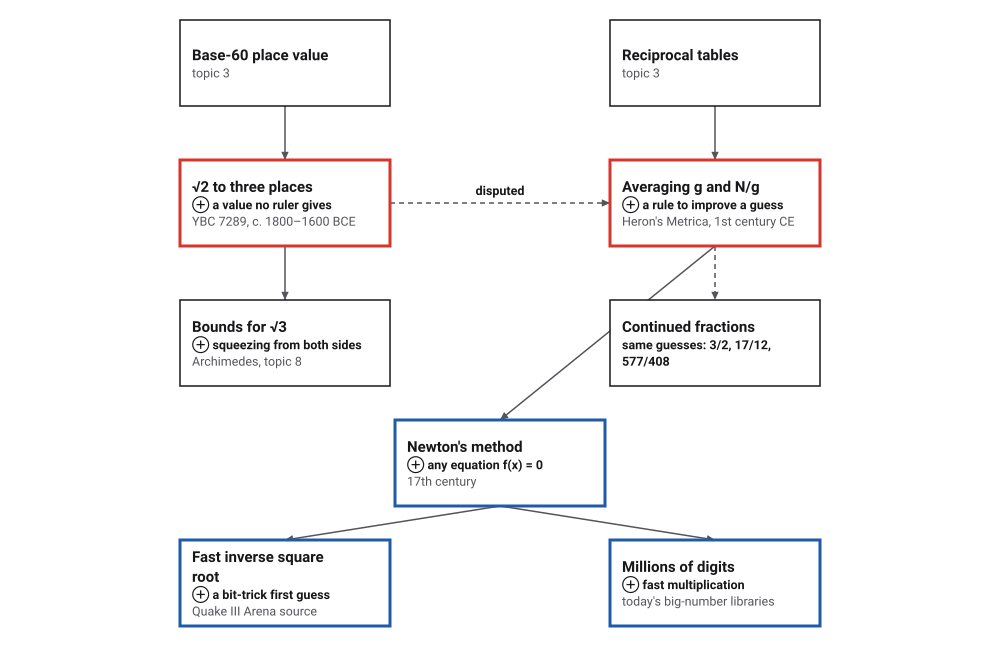
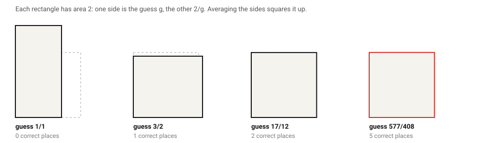
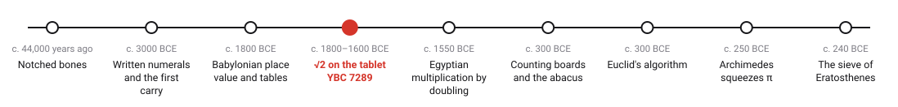
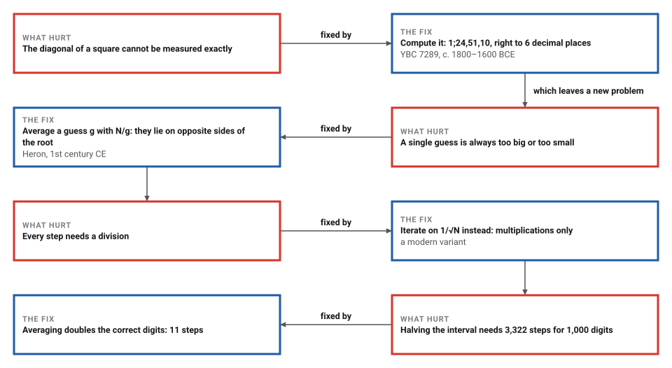
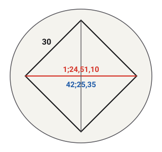
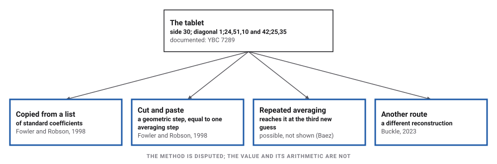
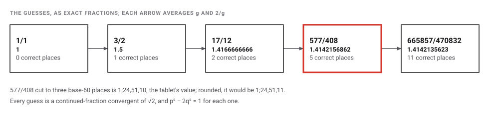
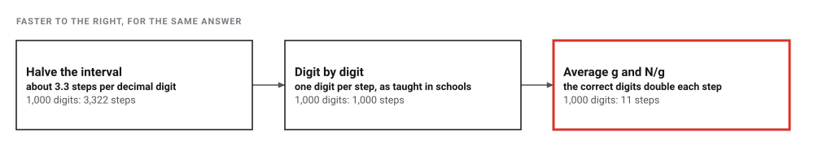

# The Square Root of Two

*Era 1 · topic 4 · c. 1800–1600 BCE* · [Era 1 index](../README.md) · [← Babylonian Place Value](../03-babylonian-place-value/README.md) · [Egyptian Doubling →](../05-egyptian-doubling/README.md) · [Interactive edition](square-root-of-two.html) · [Program](../../../code/era-01-the-first-algorithms/04-square-root-of-two/)

> **Field note from the visiting historian.** A student drew a square and its diagonals, wrote 30 on a side and two numbers along the diagonal. How the value was computed is still argued over, 3,800 years later.

| | |
|---|---|
| **When** | c. 1800–1600 BCE (sources range from 1900 to 1600) |
| **Where** | Mesopotamia · Yale Babylonian Collection (**documented**) |
| **What hurt** | Some lengths, like a square's diagonal, can never be written exactly |
| **The fix** | A computed value; later, average g and N/g to improve any guess |
| **Cost** | Averaging doubles the correct digits with every step |
| **Atlas** | Ch. 1.4 Babylonian square root · Ch. 102 Newton–Raphson |

## How ideas combined

A new algorithm is usually an older idea combined with a new one. Base-60 place value (topic 3) made a value like 1;24,51,10 writable; a rule that improves any guess made it computable. Each box names the idea that was added.

<picture>
  <source media="(prefers-color-scheme: dark)" srcset="assets/family-dark.svg">
  
</picture>
*Red: the tablet's value and the averaging rule. Blue: what the rule became. The dashed arrow from the tablet to Heron is disputed: nobody knows that the scribe averaged.*

## Square up a rectangle

To find the square root of N, start with any guess g. A rectangle with sides g and N/g has area N. If g is too small, N/g is too big, and the other way round, so the root lies between them, and so does their average. After the first step every guess is a little too big, and each new guess is closer than the last. Repeat.

<picture>
  <source media="(prefers-color-scheme: dark)" srcset="assets/squares-dark.svg">
  
</picture>
*In the interactive edition you can average your way to the square root of any number.*

## Era 1, the first algorithms

<picture>
  <source media="(prefers-color-scheme: dark)" srcset="assets/era-timeline-dark.svg">
  
</picture>

## Each fix leaves a new pain

<picture>
  <source media="(prefers-color-scheme: dark)" srcset="assets/chain-dark.svg">
  
</picture>
*Read it as a snake: each new problem sits directly under the fix that exposed it.*

## A student's tablet, 3,800 years old

YBC 7289 is a small round school tablet in the Yale Babylonian Collection. It shows a square with its diagonals. One side is marked 30. Along the diagonal are two base-60 numbers: 1;24,51,10, which is √2, and 42;25,35, which is 30 × √2, the length of this diagonal.

<picture>
  <source media="(prefers-color-scheme: dark)" srcset="assets/tablet-dark.svg">
  
</picture>
*Redrawn for this book, with the numbers in modern notation. It is not a copy of the tablet.*

|  | Value | Notes |
|---|---|---|
| The tablet: 1;24,51,10 | 1.41421296296… | off by less than 10⁻⁶ (about six decimal places); its square is 1.99999830461… |
| √2 | 1.41421356237… | in base 60: 1;24,51,10,7,46,6,… |
| Difference | -5.99E-7 | smaller than any measurement could detect |
| 30 × 1;24,51,10 | 42;25,35 | exactly, as the program checks |

<picture>
  <source media="(prefers-color-scheme: dark)" srcset="assets/readings-dark.svg">
  
</picture>
*Fowler and Robson (1998) is the standard study. Repeated averaging reaching the tablet's value shows the method is possible, not that it was used.*

## Averaging from the guess 1

<picture>
  <source media="(prefers-color-scheme: dark)" srcset="assets/iterates-dark.svg">
  
</picture>

| Step | Guess (exact) | Value | Correct places | Three base-60 places, cut | Rounded |
|---|---|---|---|---|---|
| 0 | 1/1 | 1 | 0 | — | — |
| 1 | 3/2 | 1.5 | 1 | 1;30,0,0 | 1;30,0,0 |
| 2 | 17/12 | 1.41666666667 | 2 | 1;25,0,0 | 1;25,0,0 |
| **3** | **577/408** | **1.41421568627** | **5** | **1;24,51,10** | **1;24,51,11** |
| 4 | 665857/470832 | 1.41421356237 | 11 | 1;24,51,10 | 1;24,51,10 |
| 5 | 886731088897/627013566048 | 1.41421356237 | 24 | 1;24,51,10 | 1;24,51,10 |

> **Careful.** The third new guess, 577/408, gives the tablet's digits only if you cut it off after three base-60 places: rounded, it is 1;24,51,11. Whether the scribe cut, rounded, or never averaged at all is part of the dispute.

> **Key idea.** Heron wrote the rule down in his *Metrica* (1st century CE) for √720: 720 is not a square, the next square is 729 = 27², so divide 720 by 27 and average. The program repeats it: 720/27 = 26 2/3, and the average is 26 5/6 = 161/6, whose square is 720 1/36.

## How fast does it get there?

Three ways to get the digits of √2. *Halving the interval* keeps a range that holds the root and cuts it in half at each step. *Digit by digit* is the long-hand method once taught in schools, which finds one digit per step. *Averaging* is Heron's rule. Here a guess has n correct places when its error is below 10⁻ⁿ.

<picture>
  <source media="(prefers-color-scheme: dark)" srcset="assets/threeways-dark.svg">
  
</picture>

| Correct digits wanted | Halving the interval | Digit by digit | Averaging (Heron, Newton) |
|---|---|---|---|
| 6 | 20 | 6 | **4** |
| 15 | 50 | 15 | **5** |
| 100 | 333 | 100 | **8** |
| **1,000** | **3,322** | **1,000** | **11** |

Averaging roughly doubles the correct digits at each step: 1, 2, 5, 11, 24 places for the first guesses. A division-free version, which improves a guess y for 1/√2 by y ← y(3 − 2y²)/2, reaches 15 digits in 7 steps.

## One Newton step in a video game

The source code of the video game *Quake III Arena*, published by id Software, computes 1/√x with a bit trick for the first guess and then one step of Newton's method, which improves a guess by following the tangent line of a curve. For √N, Newton's method is exactly Heron's averaging; Quake applies it to 1/√x instead. The program checks it on every float (the computer's standard 32-bit number with a fractional part) from 1 to 4, where the error pattern repeats.

> **Full circle.** Over 16,777,216 floats, the bit trick alone is off by at most **3.4376%**. One Newton step cuts that to **0.1752%**. For √2 the same method is the averaging that lands on 577/408; here it runs inside a game loop.

## Before you read on

<details>
<summary><b>1.</b> Average 1 and 2/1. Then average the result with 2 divided by it.</summary>

1 and 2 average to **3/2**. Then 2 ÷ 3/2 = 4/3, and the average of 3/2 and 4/3 is **17/12** = 1.41666…
</details>

<details>
<summary><b>2.</b> Why must g and N/g lie on opposite sides of √N?</summary>

Their product is N. If both were bigger than √N the product would be bigger than N; if both were smaller it would be smaller.
</details>

<details>
<summary><b>3.</b> Check the tablet: is 30 × 1;24,51,10 really 42;25,35?</summary>

30 × 1 = 30; 30 × 24/60 = 12; 30 × 51/3600 = 0;25,30; 30 × 10/216000 = 0;0,5. Total: **42;25,35**. The program checks it with exact fractions.
</details>

<details>
<summary><b>4.</b> How many steps does averaging need for 1,000 digits of √2? And halving?</summary>

**11** averaging steps against **3,322** halvings.
</details>

<details>
<summary><b>5.</b> Why is 577/408 special besides matching the tablet?</summary>

577² − 2 × 408² = 1: the pair (577, 408) solves Pell's equation p² − 2q² = 1. And 577/408 is a continued-fraction convergent of √2, one of the best fractions for √2 with a denominator that size.
</details>


## Where the evidence lives

| | Object | Where to see it | Licence |
|---|---|---|---|
| — | **YBC 7289**. Old Babylonian school tablet, c. 1800–1600 BCE (sources range from 1900 to 1600). Yale Babylonian Collection. | [CDLI record, with transliteration](https://cdli.earth/artifacts/255048) | Drawn for this book; photographs at the link and in Yale's film below. |

## Every link was opened before it was listed

| Level | Link | Why |
|---|---|---|
| Start | [A Cuneiform Tablet in the Digital Age](https://www.youtube.com/watch?v=Ecm15-TKOBg) — Yale University | Yale's own film about YBC 7289 and its 3D-printed copies |
| Start | [Cuneiform Numbers](https://www.youtube.com/watch?v=RR3zzQP3bII) — Numberphile | What you need to read 1;24,51,10 |
| Start | [Early Mathematics: A Short Introduction](https://www.youtube.com/watch?v=ojvdPjMhnKI) — Gresham College, Robin Wilson | Includes the Mesopotamian √2 approximation |
| Start | [The Best Known Old Babylonian Tablet?](https://old.maa.org/press/periodicals/convergence/the-best-known-old-babylonian-tablet) — MAA Convergence | A novice scribe's practice exercise; √2 correct to three sexagesimal places |
| Deeper | [Lecture 12: Square Roots, Newton's Method](https://www.youtube.com/watch?v=2YeJ-5UAke8) — MIT 6.006 (Srini Devadas), MIT OpenCourseWare | The same iteration used today for high-precision roots, with error and cost analysis |
| Deeper | [YBC 7289 — Analysis](https://personal.math.ubc.ca/~cass/Euclid/ybc/analysis.html) — Bill Casselman, UBC | Works through the numbers on the tablet |
| Deeper | [Babylonian Pythagoras](https://mathshistory.st-andrews.ac.uk/HistTopics/Babylonian_Pythagoras/) — MacTutor | Two candidate methods, and the admission that there is no evidence of the method being used elsewhere |
| Deeper | [Square Roots via Newton's Method](https://math.mit.edu/~stevenj/18.335/newton-sqrt.pdf) — MIT 18.335 note (S. G. Johnson) | Quadratic convergence: correct digits roughly double each step. It dates the Babylonians to "circa 1000 BCE", which is too late for this tablet |
| Scholar | [YBC 07289 (P255048)](https://cdli.earth/artifacts/255048) — CDLI | Catalogue record and transliteration |
| Scholar | [YBC 7289 exhibition label](https://isaw.nyu.edu/exhibitions/before-pythagoras/items/ybc-7289/) — ISAW, NYU | Museum label from *Before Pythagoras* |
| Scholar | [A 3,800-year journey from classroom to classroom](https://news.yale.edu/2016/04/11/3800-year-journey-classroom-classroom) — Yale News | Curators on the tablet and its digitisation |
| Scholar | [Square root approximations in Old Babylonian mathematics: YBC 7289 in context](https://www.sciencedirect.com/science/article/pii/S0315086098922091) — Fowler and Robson, Historia Mathematica 25 (1998) | The standard scholarly study |
| Deeper | [Heron of Alexandria](https://mathshistory.st-andrews.ac.uk/Biographies/Heron/) — MacTutor History of Mathematics | The Metrica's square root of 720, in Heron's words |
| Deeper | [q_math.c, Quake III Arena source](https://github.com/id-Software/Quake-III-Arena/blob/master/code/game/q_math.c) — id Software, on GitHub | Q_rsqrt: a bit-trick guess and one Newton step |

More, with certainty labels and the gaps we could not fill: [Era 1 reference catalog](https://github.com/vij658/AlgorithmEvolutionAtlas/blob/main/book/era-01-the-first-algorithms/reference-catalog.md).

## The program behind every number here

[SquareRootOfTwo.java](https://github.com/vij658/AlgorithmEvolutionAtlas/blob/main/code/era-01-the-first-algorithms/04-square-root-of-two/SquareRootOfTwo.java) makes **16,777,246 checks**: the tablet's arithmetic with exact fractions, every averaging step against the continued-fraction convergents and Pell's equation, the digits of three methods to 1,000 places, and the Quake III inverse square root on every float from 1 to 4. Run it with `java SquareRootOfTwo.java` (JDK 17 or newer). The heart of it:

```java
/** One averaging step for the square root of N: (g + N/g) / 2, with exact fractions. */
static Frac average(Frac g, long n) {
    BigInteger N = BigInteger.valueOf(n);
    // g = p/q: (p/q + N q/p) / 2 = (p^2 + N q^2) / (2 p q)
    BigInteger num = g.p().pow(2).add(N.multiply(g.q().pow(2)));
    BigInteger den = BigInteger.TWO.multiply(g.p()).multiply(g.q());
    BigInteger k = num.gcd(den);
    return new Frac(num.divide(k), den.divide(k));
}
```

