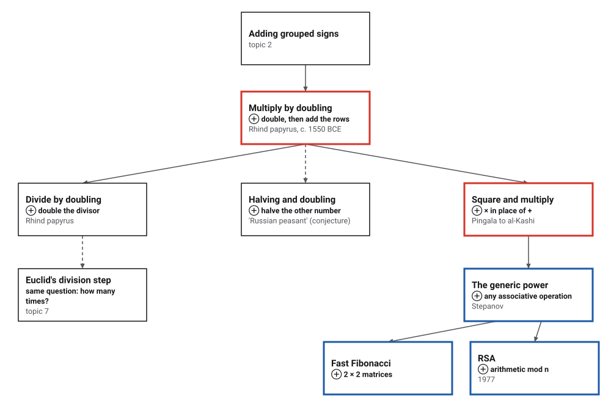
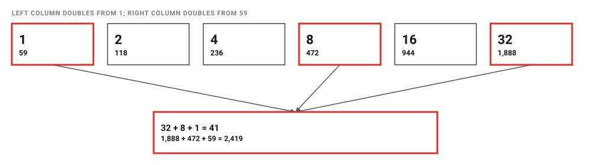
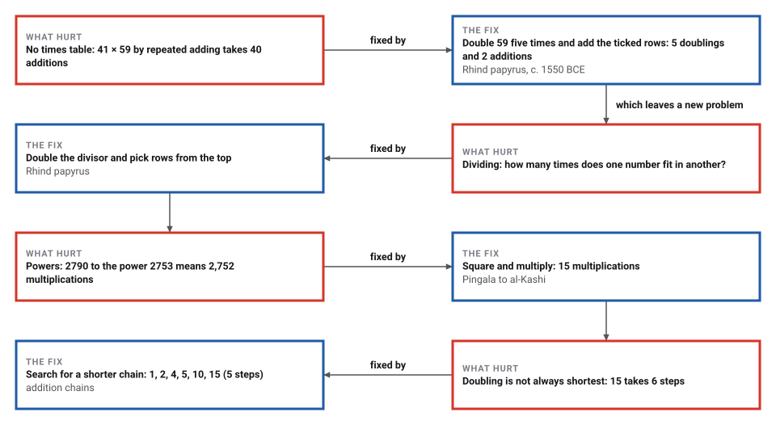
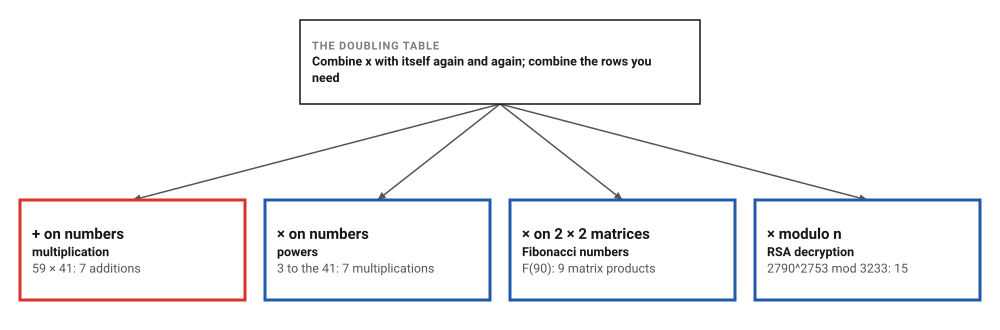
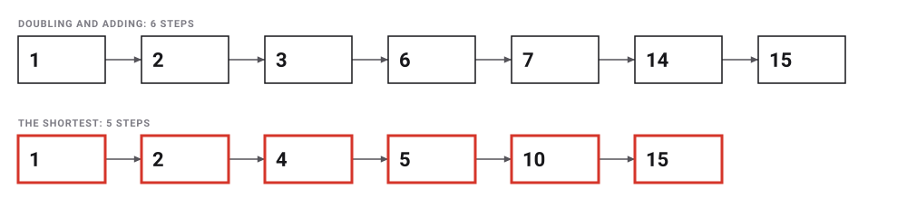

# Egyptian Doubling

*Era 1 · topic 5 · c. 1550 BCE* · [Era 1 index](../README.md) · [← The Square Root of Two](../04-square-root-of-two/README.md) · [Counting Boards →](../06-counting-boards/README.md) · [Interactive edition](egyptian-doubling.html) · [Program](../../../code/era-01-the-first-algorithms/05-egyptian-doubling/)

> **Field note from the visiting historian.** These scribes had no times table. To multiply, say, 41 by 59, a scribe doubled 59 again and again and added the rows whose multipliers make 41. They never named base 2, yet every multiplication split the multiplier into powers of two.

| | |
|---|---|
| **When** | Rhind papyrus, c. 1550 BCE, copied from an older text (dates differ: **disputed**) |
| **Where** | Egypt · British Museum (**documented**) |
| **What hurt** | Multiplying with additive numerals and no times table |
| **The fix** | Double and add: about log₂ n rows (the number of times n can be halved) |
| **Cost** | 41 × 59: 7 steps instead of 40 |
| **Atlas** | Ch. 2 Egyptian Algorithms · Ch. 94 Exponentiation |

## How ideas combined

A new algorithm is usually an older idea combined with a new one. Here adding (topic 2) is combined with itself: double, double again, and add only the rows you need. Swap the addition for multiplication and the same table computes powers. Each box names the idea that was added.

<picture>
  <source media="(prefers-color-scheme: dark)" srcset="assets/family-dark.svg">
  
</picture>
*Red: the Egyptian method, and square-and-multiply, which reuses its idea with × in place of +. Blue: where it went next. Dashed: a likely relative, not a proven descendant.*

## Double, then tick

Write 1 beside 59. Double both, again and again, while the left column stays at most 41. Then, from the bottom, tick each row whose left number still fits into what is left of 41. Add the ticked right numbers. Switch the rule to square-and-multiply and the same steps compute a power.

| Left column | Right column | Tick |
|---|---|---|
| 1 | 59 | ✓ |
| 2 | 118 |  |
| 4 | 236 |  |
| 8 | 472 | ✓ |
| 16 | 944 |  |
| 32 | 1,888 | ✓ |
*In the interactive edition you can build the table for any numbers, by doubling or by squaring.*

<picture>
  <source media="(prefers-color-scheme: dark)" srcset="assets/ticks-dark.svg">
  
</picture>

## Era 1, the first algorithms

<picture>
  <source media="(prefers-color-scheme: dark)" srcset="assets/era-timeline-dark.svg">
  
</picture>

## Each fix leaves a new pain

<picture>
  <source media="(prefers-color-scheme: dark)" srcset="assets/chain-dark.svg">
  
</picture>
*Read it as a snake: each new problem sits directly under the fix that exposed it.*

## Multiplying and dividing with one table

| Left column | Right column | Ticked? | Why |
|---|---|---|---|
| 1 | 59 | ✓ | part of 41 |
| 2 | 118 |  |  |
| 4 | 236 |  |  |
| 8 | 472 | ✓ | part of 41 |
| 16 | 944 |  |  |
| 32 | 1,888 | ✓ | part of 41 |

41 = 32 + 8 + 1, so 41 × 59 = 1,888 + 472 + 59 = **2,419**: 5 doublings and 2 additions, where adding 59 again and again takes 40.

Division runs the same table the other way: double the divisor while it fits, then take rows from the biggest down. The quotient is the sum of the left numbers taken.

| Division | Quotient | Remainder | Rows in the table |
|---|---|---|---|
| 1,000 ÷ 7 | 142 | 6 | 8 |
| 2,419 ÷ 59 | 41 | 0 | 6 |
| 696 ÷ 8 | 87 | 0 | 7 |

> **Key idea.** The ticked rows are the binary digits of the multiplier: MacTutor calls the method "a very early use of binary arithmetic". That is a modern reading. The scribes had no idea of base 2; they only needed to double and to add.

## One table, any operation

The table works for any operation that can be regrouped freely (an associative one). Alexander Stepanov, who designed C++'s Standard Template Library, built a course on this idea, from the Egyptian method to the generic power algorithm. The program runs the same code four times. (A 2 × 2 matrix is a square of four numbers that can be multiplied like a single number; *mod n* means keeping only the remainder after dividing by n.)

<picture>
  <source media="(prefers-color-scheme: dark)" srcset="assets/generic-dark.svg">
  
</picture>

| Operation | Result | Steps | One at a time |
|---|---|---|---|
| 41 copies of 59 added together | 2419 | 7 | 40 |
| 3 to the power 41 (41 copies of 3 multiplied) | 36472996377170786403 | 7 | 40 |
| Fibonacci number 90, by 2 × 2 matrix powers | 2880067194370816120 | 9 | 89 |
| RSA: 2790^2753 mod 3233 | 65 | 15 | 2,752 |

## How many steps?

| Multiplier | Doubling and adding | Adding one at a time |
|---|---|---|
| 10 | 4 | 9 |
| 41 | 7 | 40 |
| 100 | 8 | 99 |
| 1,000 | 14 | 999 |
| 1,000,000 | 25 | 999,999 |

Over 500,000 random pairs below a million, the program checked doubling, and the halving-and-doubling form (halve one number, double the other), against ordinary multiplication. The method needed **26.84** doublings and additions on average, against 499,385 additions one at a time.

Doubling is not always the shortest route. An *addition chain* builds a number from 1, each step adding two numbers already made. For 15, doubling and adding needs 6 steps; the shortest chain needs 5:

<picture>
  <source media="(prefers-color-scheme: dark)" srcset="assets/chains15-dark.svg">
  
</picture>

The program searched every number up to 128: doubling and adding is beaten for **52** of them, starting with 15, 23, 27, 30, 31, 39, 43, 45.

## The scribe's table inside every secure connection

RSA encryption needs powers of huge numbers modulo another huge number. A course note from the University of Alaska Fairbanks puts the link in one line: "replacing + with * gives the fast exponentiation by squaring trick".

> **Full circle.** For a random 2048-bit exponent the program counts **2,047 squarings and 1,015 multiplications**, 3,062 in all. Multiplying one at a time would take a number of steps with 617 digits. The same doubling idea as the Rhind papyrus's table makes it possible.

## Before you read on

<details>
<summary><b>1.</b> Multiply 13 × 24 by doubling.</summary>

Rows: 1 24, 2 48, 4 96, 8 192. 13 = 8 + 4 + 1, so add 192 + 96 + 24 = **312**.
</details>

<details>
<summary><b>2.</b> Why does 41 need exactly 6 rows?</summary>

The left column must reach the biggest power of two not above 41, which is 32: rows 1, 2, 4, …, 32.
</details>

<details>
<summary><b>3.</b> Divide 1,000 by 7 by doubling the divisor.</summary>

Double 7 while it fits: 7, 14, …, 896 (8 rows). Taking rows from the top gives quotient **142**, remainder **6**.
</details>

<details>
<summary><b>4.</b> How do you get 3 to the power 41 with 7 multiplications?</summary>

Square 3 five times: 3, 3², 3⁴, 3⁸, 3¹⁶, 3³². Then multiply the rows for 32, 8 and 1: two more multiplications.
</details>

<details>
<summary><b>5.</b> Is doubling and adding always the fastest way to build a number?</summary>

No. 15 takes 6 steps by doubling (1, 2, 3, 6, 7, 14, 15) but 5 by the chain 1, 2, 4, 5, 10, 15.
</details>


## Where the evidence lives

| | Object | Where to see it | Licence |
|---|---|---|---|
| — | **The Rhind Mathematical Papyrus**. Copied by the scribe Ahmose (also spelled Ahmes) from an older text, about 1550 BCE (other sources: c. 1650). 84 problems. British Museum EA10057 and EA10058. | [British Museum record](https://www.britishmuseum.org/collection/object/Y_EA10057) | Drawn placeholder; the museum's photographs are at the link. |

## Every link was opened before it was listed

| Level | Link | Why |
|---|---|---|
| Start | [Russian Multiplication](https://www.youtube.com/watch?v=HJ_PP5rqLg0) — Numberphile (Johnny Ball) | Halving and doubling, and why it is binary |
| Start | [How Ancient Egyptians Multiplied Numbers Quickly](https://www.youtube.com/watch?v=qHXsKyVSPOU) — MindYourDecisions (Presh Talwalkar) | The Egyptian method, its "Russian peasant" form, and why it works |
| Start | [Early Mathematics: A Short Introduction](https://www.youtube.com/watch?v=ojvdPjMhnKI) — Gresham College, Robin Wilson | The Rhind papyrus, doubling and halving, unit fractions |
| Start | [Mathematics in Egyptian Papyri](https://mathshistory.st-andrews.ac.uk/HistTopics/Egyptian_papyri/) — MacTutor | 41 × 59 worked by doubling, plus the Rhind and Moscow problems |
| Deeper | [Four Algorithmic Journeys Part 1: Spoils of the Egyptians](https://www.youtube.com/playlist?list=PLHxtyCq_WDLV5N5zUCBCDC2WqF1VBDGg1) — Alexander Stepanov (A9), lecture playlist | From Ahmes's 41 × 59 to the generic power algorithm. Lecture notes (PDF) |
| Deeper | [From Mathematics to Generic Programming: The First Algorithm](https://www.informit.com/articles/article.aspx?p=2264460) — Stepanov and Rose (book excerpt) | Ahmes's algorithm and why it relies on associativity |
| Deeper | [Fast multiplication / exponentiation](https://www.cs.uaf.edu/2013/spring/cs463/lecture/02_13_multiplication.html) — University of Alaska Fairbanks, CS 463 notes | "Replacing + with * gives the fast exponentiation by squaring trick", and why RSA needs it |
| Scholar | [Rhind Mathematical Papyrus, EA10057](https://www.britishmuseum.org/collection/object/Y_EA10057) — British Museum | Catalogue records of both sections |
| Scholar | [Learn maths like an Egyptian](https://www.britishmuseum.org/blog/learn-maths-egyptian-secrets-rhind-mathematical-papyrus) — British Museum blog (curator, 2025) | The papyrus as Ahmose's copy of an older original |
| Scholar | [Egyptian multiplication and some of its ramifications](https://arxiv.org/html/1901.10961) — M. H. van Emden, arXiv | From the binary expansion to exponentiation, division and logarithms |
| Scholar | [On the history of the square-and-multiply algorithm](https://arxiv.org/html/2606.00958) — Aydin et al., arXiv (2026 preprint) | From Pingala (c. 200 BCE) to al-Kashi (1427). It does not cover Egypt |

More, with certainty labels and the gaps we could not fill: [Era 1 reference catalog](https://github.com/vij658/AlgorithmEvolutionAtlas/blob/main/book/era-01-the-first-algorithms/reference-catalog.md).

## The program behind every number here

[EgyptianDoubling.java](https://github.com/vij658/AlgorithmEvolutionAtlas/blob/main/code/era-01-the-first-algorithms/05-egyptian-doubling/EgyptianDoubling.java) makes **1,701,049 checks**: doubling and halving-and-doubling against ordinary multiplication on 500,000 random pairs, division by doubling on 200,000 more, the generic power on four operations, and a search for the shortest addition chain of every number up to 128. Run it with `java EgyptianDoubling.java` (JDK 17 or newer). The heart of it:

```java
/** The scribe's table for a x b: double until the multiplier would pass a, then tick rows from the bottom up. */
static List<Row> table(long a, long b) {
    List<long[]> rows = new ArrayList<>();
    for (long m = 1, v = b; m <= a; m += m, v += v) rows.add(new long[]{m, v});   // doubling = adding to itself
    List<Row> out = new ArrayList<>();
    long left = a;
    boolean[] tick = new boolean[rows.size()];
    for (int i = rows.size() - 1; i >= 0; i--) {                       // the biggest multiplier that still fits
        if (rows.get(i)[0] <= left) { tick[i] = true; left -= rows.get(i)[0]; }
    }
    for (int i = 0; i < rows.size(); i++) out.add(new Row(rows.get(i)[0], rows.get(i)[1], tick[i]));
    return out;
}

/** x op x op ... op x (n times, n >= 1), with about log2(n) steps: the Egyptian table with a general "add". */
static <T> T power(T x, long n, BinaryOperator<T> op) {
    T result = null;
    while (true) {
        if ((n & 1) == 1) { result = result == null ? x : op.apply(result, x); if (result != x) opCount++; }
        n >>= 1;
        if (n == 0) return result;
        x = op.apply(x, x);                                                  // "double": combine x with itself
        opCount++;
    }
}
```

