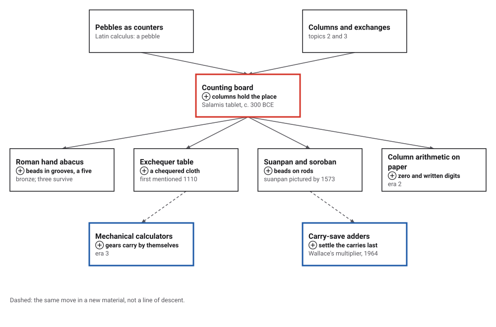
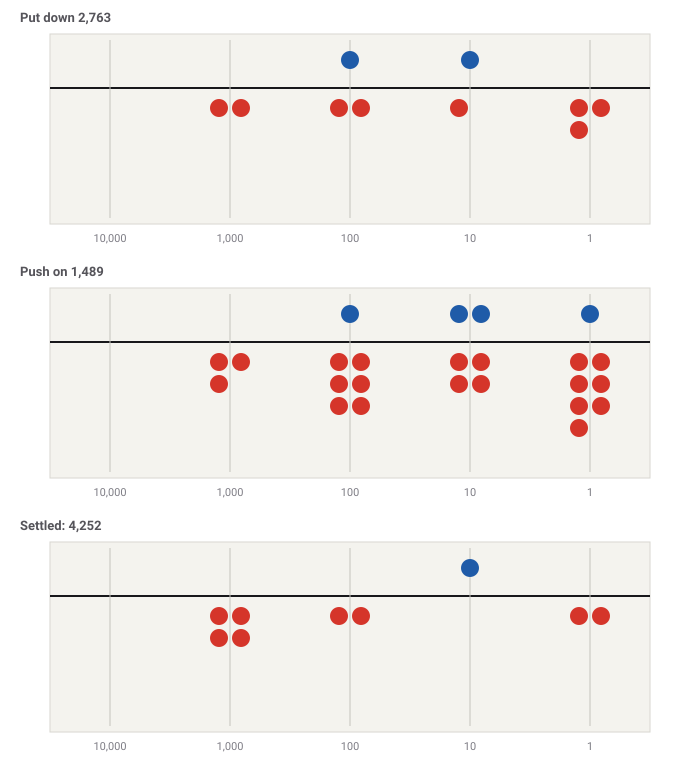
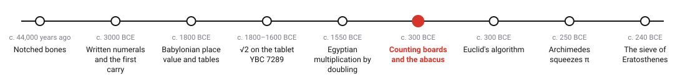
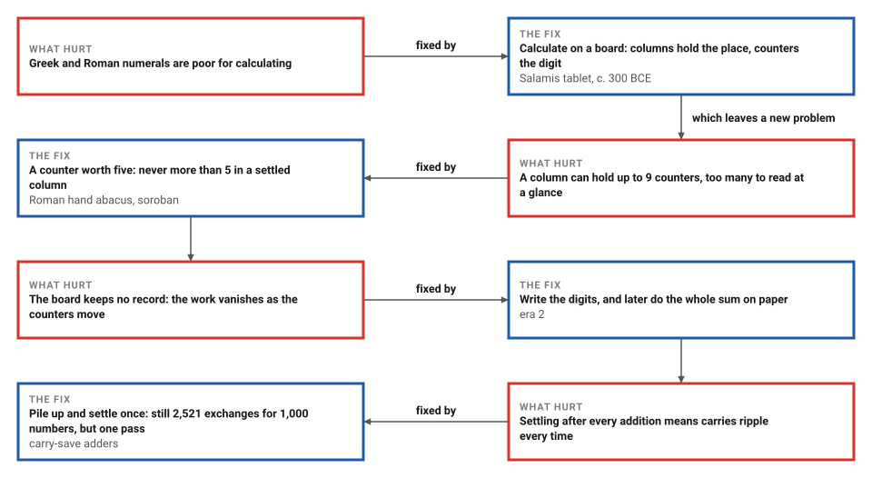
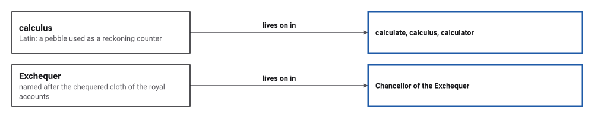
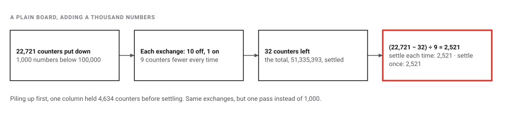

# Counting Boards

*Era 1 · topic 6 · c. 300 BCE* · [Era 1 index](../README.md) · [← Egyptian Doubling](../05-egyptian-doubling/README.md) · [Euclid's Algorithm →](../07-euclids-algorithm/README.md) · [Interactive edition](counting-boards.html) · [Program](../../../code/era-01-the-first-algorithms/06-counting-boards/)

> **Field note from the visiting historian.** Their word calculus is Latin for a small pebble, and the English Exchequer takes its name from a counting table that looked like a chessboard.

| | |
|---|---|
| **When** | Salamis tablet c. 300 BCE · Roman hand abaci · Exchequer table first mentioned 1110 |
| **Where** | Greece, Rome, England, China, Japan |
| **What hurt** | Written Greek and Roman numerals were poor for calculating |
| **The fix** | A place-value machine: push counters, then settle |
| **Cost** | 27.2 counter moves per addition of two numbers below 10,000, with fives |
| **Atlas** | Ch. 7.2 The abacus: an early physical algorithm machine |

## How ideas combined

A new algorithm is usually an older idea combined with a new one. The counting board puts the exchange of topic 2 and the place value of topic 3 into the hands: columns hold the place, and pebbles hold the count. Each box names the idea that was added.

<picture>
  <source media="(prefers-color-scheme: dark)" srcset="assets/family-dark.svg">
  
</picture>
*Red: the counting board. Blue: machines that settle carries for you, or put it off on purpose.*

## Push the counters, then settle

Put down the first number: in each column, as many counters as its digit, with a five-counter above the bar (the line that separates fives from ones) when it saves counters. Push on the second number. Then settle: five ones make a five, and two fives make one counter in the next column.

<picture>
  <source media="(prefers-color-scheme: dark)" srcset="assets/board-dark.svg">
  
</picture>
*In the interactive edition you can push counters on and settle them one exchange at a time.*

No digit is written at any point. The Latin name for a reckoning pebble, *calculus*, is where the word *calculate* comes from.

## Era 1, the first algorithms

<picture>
  <source media="(prefers-color-scheme: dark)" srcset="assets/era-timeline-dark.svg">
  
</picture>

## Each fix leaves a new pain

<picture>
  <source media="(prefers-color-scheme: dark)" srcset="assets/chain-dark.svg">
  
</picture>
*Read it as a snake: each new problem sits directly under the fix that exposed it.*

## 2,763 + 1,489 on two boards

| Stage | Plain board (counters per column) | Counters | Board with fives (fives + ones) | Counters |
|---|---|---|---|---|
| Put down 2763 | 2 · 7 · 6 · 3 | 18 | 0+2 · 1+2 · 1+1 · 0+3 | 10 |
| Push on 1489 | 3 · 11 · 14 · 12 | 40 | 0+3 · 1+6 · 2+4 · 1+7 | 24 |
| Settled | 4 · 2 · 5 · 2 | 13 | 0+4 · 0+2 · 1+0 · 0+2 | 9 |

Both boards end at **4,252**. The plain board needed 3 exchanges and 73 counter moves in all; the board with fives needed 6 smaller exchanges but only 51 moves, because there are fewer counters to push.

> **Key idea.** The board is a machine for place value. The person adding never thinks about tens or hundreds: they only push counters and make one or two kinds of swap. Later, gears would make that swap by themselves.

## What survives, and what is guessed

The Salamis tablet (Epigraphical Museum, Athens, EM 11515) is a marble slab with ruled lines and Greek number signs, dated to about 300 BCE (the Computer History Museum says the 4th century BCE). The museum says it is "believed to be a table of mathematical calculations or a toy"; it was once thought to be a gaming board. Its use is **disputed**.

Three bronze Roman hand abaci survive, in Aosta, Paris and Rome (**documented**). In England, the *Dialogue concerning the Exchequer* (about 1179) describes the royal accounts being reckoned with counters on a table covered with a black cloth marked in stripes, and traces the name Exchequer to the table's likeness to a chessboard (**documented**). Early dates for the Chinese suanpan and the Japanese soroban vary widely between sources (**disputed**).

<picture>
  <source media="(prefers-color-scheme: dark)" srcset="assets/words-dark.svg">
  
</picture>

## Is a five-counter worth it?

| Per addition of two numbers below 10,000 | Plain board | Board with fives |
|---|---|---|
| Counters left on the board | 18.53 | 10.50 |
| Counters moved | 39.39 | **27.22** |
| Exchanges | 1.94 | 3.84 |
| Most counters in a settled column | 9 | 5 |

Fives cut the counters on the board by 43% and the moves by 31%, at the price of about twice as many (smaller) exchanges. The program checked 200,000 additions and 200,000 subtractions, with borrowing, on both boards.

<picture>
  <source media="(prefers-color-scheme: dark)" srcset="assets/invariant-dark.svg">
  
</picture>

On the board with fives the count is also fixed: 5,033 exchanges either way. Each column's exchanges are forced by what lands in it, so their order cannot change their number.

## Settle the carries last

A board lets you pile counters up and settle once at the end; nothing breaks while a column is overfull. Fast hardware multipliers do the same. They add many rows of bits at once and keep the carries unsettled, as a second row of numbers, until a single final addition: the carry-save idea.

> **Full circle.** C. S. Wallace's 1964 design for a fast multiplier generated "the product of two numbers using purely combinational logic, i.e., in one gating step": by wiring alone, without stepping through a sequence. The program shows why delaying is safe: adding 1,000 numbers, settling after each one and settling once at the end make exactly the same **2,521** exchanges. Only the waiting changes.

## Before you read on

<details>
<summary><b>1.</b> Put 3,746 on a board with fives. How many counters?</summary>

Thousands 3 ones; hundreds 1 five + 2 ones; tens 4 ones; ones 1 five + 1 one: **12 counters**, against 20 on a plain board.
</details>

<details>
<summary><b>2.</b> On a plain board, a column holds 14 counters. What do you do?</summary>

Take 10 off and put 1 in the next column: 4 stay. That is the carry.
</details>

<details>
<summary><b>3.</b> Why does the board with fives make more exchanges (6) than the plain board (3) for 2,763 + 1,489?</summary>

Each carry takes two smaller steps: five ones become a five, then two fives become one counter in the next column.
</details>

<details>
<summary><b>4.</b> If you add 1,000 numbers and settle only at the end, do you save exchanges?</summary>

No: 2,521 either way. Every exchange removes exactly 9 counters, so their number is fixed by the counters put down (22,721) and left (32). You save passes, not exchanges.
</details>

<details>
<summary><b>5.</b> Where does the word <em>calculate</em> come from?</summary>

From Latin *calculus*, a pebble used as a reckoning counter.
</details>


## Where the evidence lives

| | Object | Where to see it | Licence |
|---|---|---|---|
| — | **The Salamis tablet**. Marble counting board, c. 300 BCE. Epigraphical Museum, Athens, EM 11515. | [The museum's permanent exhibition](https://epigraphicmuseum.gr/en/permanent-exhibition/) | Drawn placeholder. |
| — | **Salamis counting table, replica**. Marble replica made in 1966 by Dorothy M. Briggs. Smithsonian, National Museum of American History. | [Smithsonian record](https://www.si.edu/object/nmah_690540) | Drawn placeholder. The record is CC0; its photograph can be viewed at the link. |
| — | **The Exchequer**. The *Dialogue concerning the Exchequer*, c. 1179, describes the counting table and its striped black cloth. | [The text, Avalon Project (Yale Law School)](https://avalon.law.yale.edu/medieval/excheq.asp) | Drawn placeholder. |

## Every link was opened before it was listed

| Level | Link | Why |
|---|---|---|
| Start | [Introduction to the Roman abacus and counting board](https://www.youtube.com/watch?v=c-2I09cmth0) — Reading Ancient Schoolroom (University of Reading) | Reconstructed Roman reckoning. Follow-up: Multiplication on the Roman abacus |
| Start | [The Salamis Tablet — Calculating on a Counting board](https://www.youtube.com/watch?v=mYR4qa3pswU) — Jens Puhle | A Salamis-style board demonstrated, cited by Wikipedia (independent creator) |
| Start | [Seeing Numbers with Soroban — The Japanese Abacus](https://www.youtube.com/watch?v=Q7OYQqPLH0o) — The Japan Society | How the soroban is used (ages 7–11 and up) |
| Start | [Revolution: Calculators — Abacus](https://www.computerhistory.org/revolution/calculators/1/1) — Computer History Museum | Abaci from China to Greece to the Inca, with the Salamis tablet |
| Deeper | [In Search of A Rare Roman Pocket Calculator](https://cacm.acm.org/blogcacm/in-search-of-a-rare-roman-pocket-calculator/) — Communications of the ACM blog | Tracking down the surviving Roman hand abaci |
| Deeper | [The Abacus, the Numeral Frame, and Counters](https://www.si.edu/spotlight/the-abacus-the-numeral-frame-and-counters) — Smithsonian | European counting boards, suanpan and soroban (it wrongly calls *calculi* Greek; the word is Latin) |
| Scholar | [Exploring Ancient Greek and Roman Numeracy](https://www.youtube.com/watch?v=-45Hxj6Txoo) — Gresham College, Serafina Cuomo (2011) | The Salamis abacus, the Aosta abacus, finger counting, and what remains unknown |
| Scholar | [Permanent exhibition: the Salamis tablet](https://epigraphicmuseum.gr/en/permanent-exhibition/) — Epigraphical Museum, Athens | The holding museum's description |
| Scholar | [Salamis Counting Table (replica)](https://www.si.edu/object/nmah_690540) — Smithsonian NMAH | Replica record; calculation by moving pebbles along lines |
| Scholar | [The Dialogue concerning the Exchequer](https://avalon.law.yale.edu/medieval/excheq.asp) — Avalon Project, Yale Law School (Henderson's translation) | Primary text, c. 1179 |
| Scholar | [A Suggestion for a Fast Multiplier](https://scispace.com/papers/a-suggestion-for-a-fast-multiplier-12zf7tphek) — C. S. Wallace, IEEE Transactions on Electronic Computers 13 (1964) | Adding many rows at once and settling the carries at the end |

More, with certainty labels and the gaps we could not fill: [Era 1 reference catalog](https://github.com/vij658/AlgorithmEvolutionAtlas/blob/main/book/era-01-the-first-algorithms/reference-catalog.md).

## The program behind every number here

[CountingBoard.java](https://github.com/vij658/AlgorithmEvolutionAtlas/blob/main/code/era-01-the-first-algorithms/06-counting-boards/CountingBoard.java) makes **2,600,007 checks**: 200,000 additions and 200,000 subtractions with borrowing on plain boards and boards with fives, every settled column in standard form, and the exchange invariant. Run it with `java CountingBoard.java` (JDK 17 or newer). The heart of it:

```java
    /** Settle: exchange until every column is in standard form (plain: at most 9; with fives: at most 1 five, 4 ones). */
    void settle() {
        for (int i = 0; i < COLUMNS; i++) {
            if (withFives) {
                while (ones[i] >= 5) { ones[i] -= 5; fives[i]++; removed += 5; placed++; exchanges++; }
                while (fives[i] >= 2) { fives[i] -= 2; ones[i + 1]++; removed += 2; placed++; exchanges++; }
                // a carried-in counter can make five ones again in the next column: the loop reaches it next
            } else {
                while (ones[i] >= 10) { ones[i] -= 10; ones[i + 1]++; removed += 10; placed++; exchanges++; }
            }
        }
    }
```

