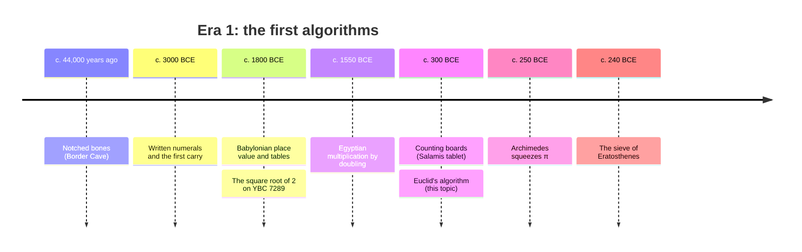
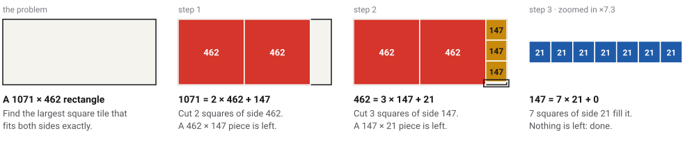
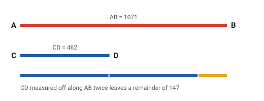
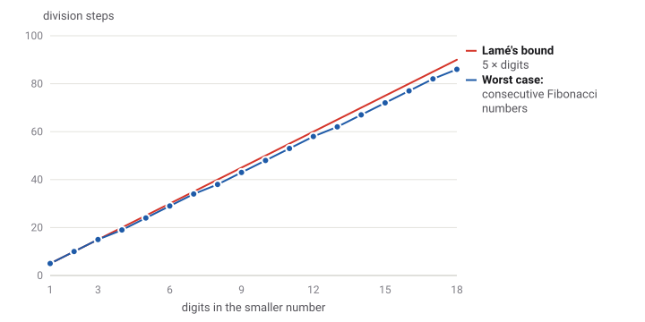
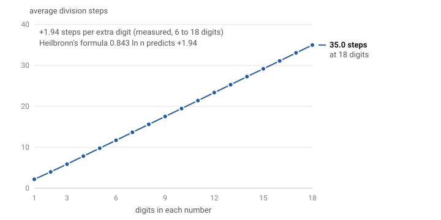
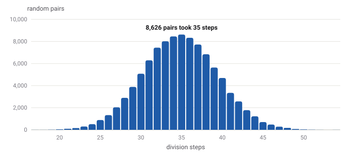
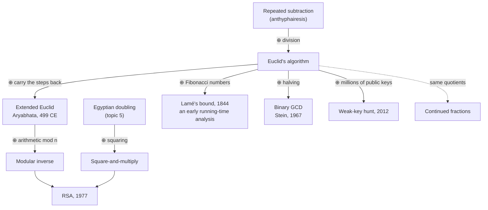

# Euclid's algorithm

*Era 1 · topic 7 · c. 300 BCE* · [Era 1 reference catalog](../reference-catalog.md#7-euclids-algorithm) · [Interactive edition](euclids-algorithm.html) · [Program](../../../code/era-01-the-first-algorithms/07-euclids-algorithm/)

> **Field note from the visiting historian.** Earlier procedures computed a value. This one stops on its own and is *proved* to work for every pair of numbers. Take the smaller from the larger, again and again; what is left at the end measures both. Twenty-three centuries later it still runs, in spirit unchanged, inside every encryption library.

| | |
|---|---|
| **When** | c. 300 BCE (the method probably predates Euclid) |
| **Where** | Alexandria; Euclid's *Elements*, Book VII, Propositions 1–2 |
| **What hurt** | Finding the greatest common measure of two numbers meant trying every candidate |
| **The fix** | Replace the pair (a, b) by (b, a mod b) until the remainder is 0 |
| **Cost** | At most 5 × the digits of the smaller number in division steps (Lamé, 1844) |
| **Atlas** | Ch. 4, *The Euclidean Algorithm*; Ch. 92, *Number Theory* |
| **Certainty** | **documented** (the text survives); **conjecture** for earlier origins |

## Where it sits in time



## What hurt, and what fixed it

```mermaid
flowchart LR
  P0["Try every candidate<br/>until one divides both"]:::pain --> F1["Take the smaller from the larger<br/>Elements VII, c. 300 BCE"]:::fix
  F1 --> P1["1,000,000 and 1 need<br/>1,000,000 subtractions"]:::pain
  P1 --> F2["One division does a whole run<br/>(a mod b)"]:::fix
  F2 --> P2["The gcd alone is not enough:<br/>find x, y with ax + by = gcd"]:::pain
  P2 --> F3["Carry the steps back<br/>Aryabhata's pulverizer, 499 CE"]:::fix
  F3 --> P3["How slow can it get?"]:::pain
  P3 --> F4["Never more than 5 × digits<br/>Lamé, 1844"]:::fix
  classDef pain stroke:#d5352a,stroke-width:2px
  classDef fix stroke:#1f5ba8,stroke-width:2px
```



Red outlines are the pains; blue outlines are the fixes.

## The idea, as a picture

Two numbers are the two sides of a rectangle. Cut off the biggest square you can, as many times as it fits; then do the same to the piece that is left. When a piece is filled exactly by squares, the side of those squares measures both of the original sides. It is the greatest common divisor.

<picture>
  <source media="(prefers-color-scheme: dark)" srcset="assets/euclid-squares-dark.svg">
  
</picture>

The number of squares cut at each stage, **2, 3, 7**, is also the continued fraction 1071/462 = [2; 3, 7]. Every Euclid computation hides one.

Euclid himself drew numbers as line segments and measured one off along the other:

<picture>
  <source media="(prefers-color-scheme: dark)" srcset="assets/segments-dark.svg">
  
</picture>

*Drawn for this book in the style of the* Elements*; not a copy of any manuscript.*

## Step by step

| Step | Division | Quotient (squares cut) | Remainder |
|---|---|---|---|
| 1 | 1,071 = 2 × 462 + 147 | 2 | 147 |
| 2 | 462 = 3 × 147 + 21 | 3 | 21 |
| 3 | 147 = 7 × 21 + 0 | 7 | 0 |

The last non-zero remainder, **21**, is gcd(1071, 462).

> **Wrong turn.** Euclid subtracted, one copy at a time. That is fine for 1071 and 462 (12 subtractions), but 1,000,000 and 1 need **1,000,000 subtractions** where a single division is enough. Division is subtraction done in bulk.

### Going backwards: the pulverizer

Run the steps in reverse and the remainders become combinations of the two starting numbers. Each row keeps the promise *remainder = s × 1071 + t × 462*:

| Row | Quotient | Remainder | s | t | Check |
|---|---|---|---|---|---|
| 0 | — | 1,071 | 1 | 0 | 1 × 1071 + 0 × 462 = 1,071 |
| 1 | — | 462 | 0 | 1 | 0 × 1071 + 1 × 462 = 462 |
| 2 | 2 | 147 | 1 | -2 | 1 × 1071 − 2 × 462 = 147 |
| 3 | 3 | 21 | -3 | 7 | -3 × 1071 + 7 × 462 = 21 |
| 4 | 7 | 0 | 22 | -51 | 22 × 1071 − 51 × 462 = 0 |

So **21 = -3 × 1071 + 7 × 462** (Bézout's identity). Aryabhata called the method *kuttaka*, "pulverizing", because the numbers get smaller and smaller with each step. When the gcd is 1, *s* is the inverse of the first number modulo the second, and that inverse is how RSA key generation finds its matching exponent: 17 × 2,753 = 1 (mod 3,120).

## Four ways to find a gcd

Counts of the basic operations each method makes, from the program:

| Pair | gcd | Trying every candidate | Repeated subtraction (Euclid) | Division | Binary GCD (Stein) |
|---|---|---|---|---|---|
| 1,071 and 462 (the worked example) | 21 | 442 | 12 | **3** | 5 |
| 89 and 55 (consecutive Fibonacci numbers) | 1 | 55 | 10 | **9** | 5 |
| 1,000,000 and 1 (a huge and a tiny number) | 1 | 1 | 1,000,000 | **1** | 7 |
| 2,971,215,073 and 1,836,311,903 (10-digit consecutive Fibonacci numbers) | 1 | 1,836,311,903 | 46 | **45** | 26 |
| 917,151,100,147,030,119 and 740,488,968,177,717,441 (a random 18-digit pair) | 3 | 740,488,968,177,717,439 | 267 | **41** | 45 |

Trying candidates grows with the size of the numbers. Subtraction can explode. Division grows only with the number of *digits*. Stein's binary method (published 1967) uses halving and subtraction, which suit hardware without fast division.

## How fast is it? Measured

The worst case is consecutive Fibonacci numbers: every quotient is 1, so each step takes away as little as possible. Lamé proved in 1844 that the steps never exceed five times the number of digits of the smaller number.

<picture>
  <source media="(prefers-color-scheme: dark)" srcset="assets/worst-case-dark.svg">
  
</picture>

For random numbers it is much better. The average grows by about two steps per extra digit, as Heilbronn's formula 0.843 ln n predicts:

<picture>
  <source media="(prefers-color-scheme: dark)" srcset="assets/average-case-dark.svg">
  
</picture>

And for random 18-digit pairs the counts bunch tightly around the middle; even the slowest pair needed 54 steps, well under Lamé's 90:

<picture>
  <source media="(prefers-color-scheme: dark)" srcset="assets/steps-histogram-dark.svg">
  
</picture>

## How ideas combined



*A ⊕ B = C: a new algorithm is an older idea combined with a new one.*

## Full circle

In 2012 a team from UC San Diego and the University of Michigan collected the public keys of millions of internet hosts and computed the greatest common divisors between them. Keys made with poor randomness share a prime factor, and a shared factor gives the private key away: they recovered RSA private keys for **0.50% of TLS hosts and 0.03% of SSH hosts** (*Mining Your Ps and Qs*, USENIX Security 2012; [factorable.net](https://factorable.net/)). An algorithm from 300 BCE found the weak locks.

## Pause and try

<details>
<summary><b>1.</b> Find gcd(48, 18). How many divisions does it take?</summary>

48 = 2 × 18 + 12<br/>18 = 1 × 12 + 6<br/>12 = 2 × 6 + 0<br/>
So gcd(48, 18) = **6**, in **3** divisions.
</details>

<details>
<summary><b>2.</b> Why must the algorithm stop?</summary>

Each remainder is smaller than the number it was divided by, so the second number of the pair gets strictly smaller at every step. A list of whole numbers that keeps getting smaller cannot go on forever, so it reaches 0.
</details>

<details>
<summary><b>3.</b> Which pair of numbers below 100 makes the algorithm work hardest?</summary>

**(89, 55)**, two consecutive Fibonacci numbers, with **9** divisions. The program checked every pair below 100.
</details>

<details>
<summary><b>4.</b> Write 21 as a combination of 1071 and 462.</summary>

21 = **-3** × 1071 + **7** × 462. Check: -3,213 + 3,234 = 21.
</details>

<details>
<summary><b>5.</b> Is it faster to find gcd(1,000,000, 1) by subtraction or by division?</summary>

Division: **1** step against **1,000,000** subtractions.
</details>

## The objects

| | Object | What it shows | Licence |
|---|---|---|---|
|  | **The first printed edition** of the *Elements*, printed by Erhard Ratdolt, Venice, 25 May 1482 | [Smithsonian Libraries' digitised copy](https://library.si.edu/digital-library/book/preclarissimusl00eucl) | CC0 (public domain), photo shown |
| — | **MS. D'Orville 301**, Bodleian Library: a Byzantine manuscript of the *Elements*, dated 888, written by Stephanos the clerk | [Catalogue entry](https://medieval.bodleian.ox.ac.uk/catalog/manuscript_4146) with links to the digital facsimile | Most Digital Bodleian images are CC BY-NC 4.0; linked, not copied |
| — | **P. Oxy. 29**, Penn Museum E2748: a papyrus fragment of Book II, Proposition 5, with its diagram. The museum dates it 200–400 CE; the papyrologist Eric Turner argued for 75–125 CE (**disputed**) | [Penn Museum record](https://collections.penn.museum/collections/object/63505) · [Bill Casselman's photographs and notes](https://personal.math.ubc.ca/~cass/Euclid/papyrus/papyrus.html) | No licence stated; linked, not copied |

## Watch and read

| Level | Link | Why |
|---|---|---|
| Start | [Euclid's Algorithm — Numberphile](https://www.youtube.com/watch?v=6Y3jHHE_hbA) | The algorithm and its Fibonacci connection |
| Start | [The Euclidean Algorithm (Finding the GCD/GCF) — Houston Math Prep](https://www.youtube.com/watch?v=SR-jmdjzw-Y) | Worked examples, step by step |
| Start | [Here's looking at Euclid — Gresham College, Robin Wilson](https://www.youtube.com/watch?v=9O97Xad-iTQ) | Greek mathematics and the *Elements* |
| Deeper | [MIT 6.042J Lecture 4 — MIT OpenCourseWare](https://www.youtube.com/watch?v=NuY7szYSXSw) | GCD, Euclid's algorithm and the Pulverizer |
| Deeper | [Euclid's Algorithm — Cut the Knot](https://www.cut-the-knot.org/blue/Euclid.shtml) | Why gcd(a, b) = gcd(b, r), and Bézout's identity |
| Deeper | [Euclidean Algorithm — Wolfram MathWorld](https://mathworld.wolfram.com/EuclideanAlgorithm.html) | Lamé's bound, the Fibonacci worst case, average steps |
| Scholar | [Elements VII.1](https://mathcs.clarku.edu/~djoyce/elements/bookVII/propVII1.html) and [VII.2](https://mathcs.clarku.edu/~djoyce/elements/bookVII/propVII2.html) — D. E. Joyce | The propositions themselves |
| Scholar | [Origins of the analysis of the Euclidean algorithm — J. Shallit, Historia Mathematica (1994)](https://www.sciencedirect.com/science/article/pii/S0315086084710317) | Who first bounded the running time |
| Scholar | [Aryabhata I — MacTutor](https://mathshistory.st-andrews.ac.uk/Biographies/Aryabhata_I/) | The *kuttaka* ("pulverizer") and its link to Euclid's algorithm |
| Scholar | [Rivest, Shamir and Adleman (1977)](https://people.csail.mit.edu/rivest/Rsapaper.pdf) | "Use the following variation of Euclid's algorithm" to compute the RSA exponents |

## Prove it

The program behind every number on this page: [EuclidsAlgorithm.java](../../../code/era-01-the-first-algorithms/07-euclids-algorithm/EuclidsAlgorithm.java). It makes **1,444,574 checks**: every method against Java's `BigInteger.gcd`, Bézout's identity on 200,000 random pairs, Lamé's bound exhaustively below 1,000, and the continued fractions rebuilt exactly. The heart of it:

```java
/** The modern form: one division does a whole run of subtractions. */
static long gcd(long a, long b) {
    while (b != 0) {
        long r = a % b;                                // what is left after taking b away as often as possible
        a = b;
        b = r;
    }
    return a;
}

/** Rows of the extended algorithm: {quotient, remainder, s, t} with remainder = s*a + t*b on every row. */
static List<long[]> extendedRows(long a, long b) {
    List<long[]> rows = new ArrayList<>();
    long r0 = a, r1 = b, s0 = 1, s1 = 0, t0 = 0, t1 = 1;
    rows.add(new long[]{0, r0, s0, t0});
    rows.add(new long[]{0, r1, s1, t1});
    while (r1 != 0) {
        long q = r0 / r1;
        long r2 = r0 - q * r1, s2 = s0 - q * s1, t2 = t0 - q * t1;
        rows.add(new long[]{q, r2, s2, t2});
        r0 = r1; r1 = r2; s0 = s1; s1 = s2; t0 = t1; t1 = t2;
    }
    return rows;
}
```

Run it with `java EuclidsAlgorithm.java` (JDK 17 or newer). These figures and tables are regenerated from its output by [`code/tools/figures/euclid_topic.py`](../../../code/tools/figures/euclid_topic.py).
