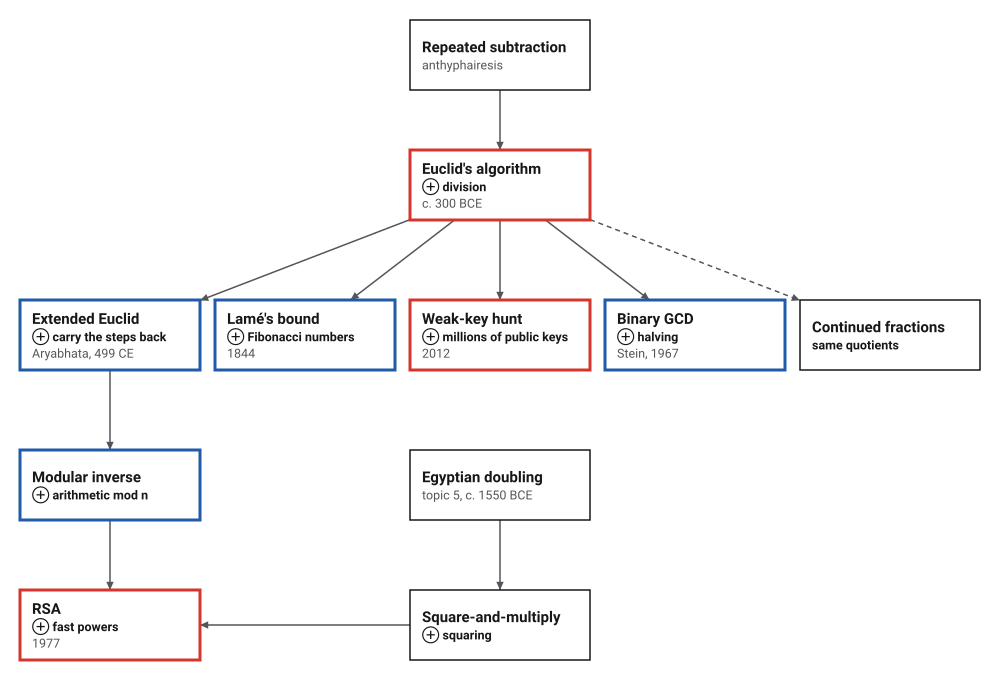
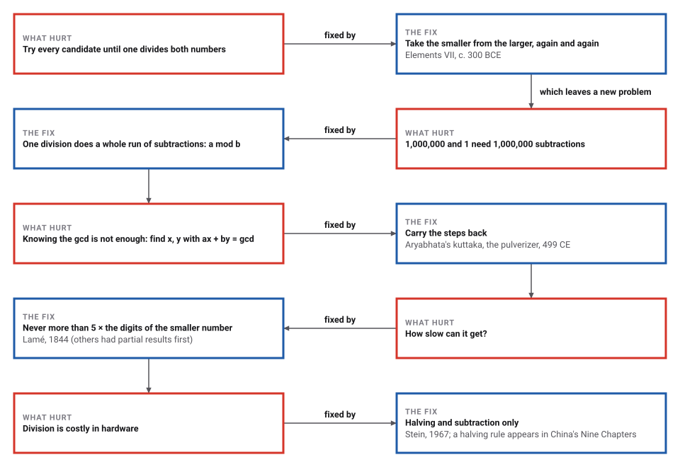
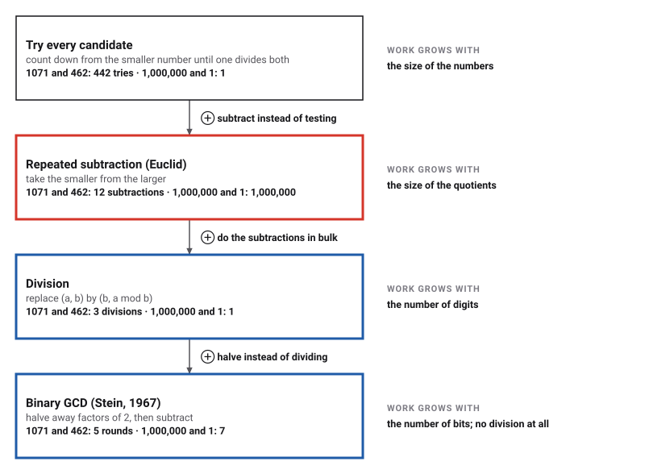
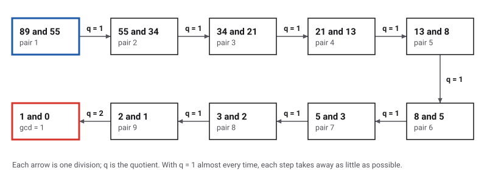
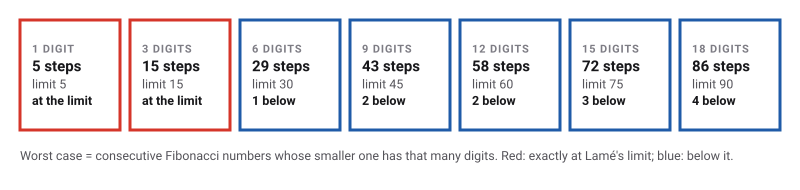
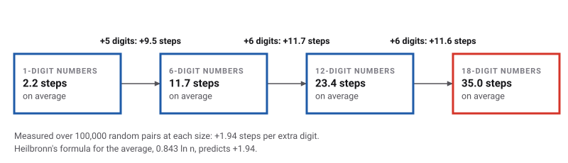
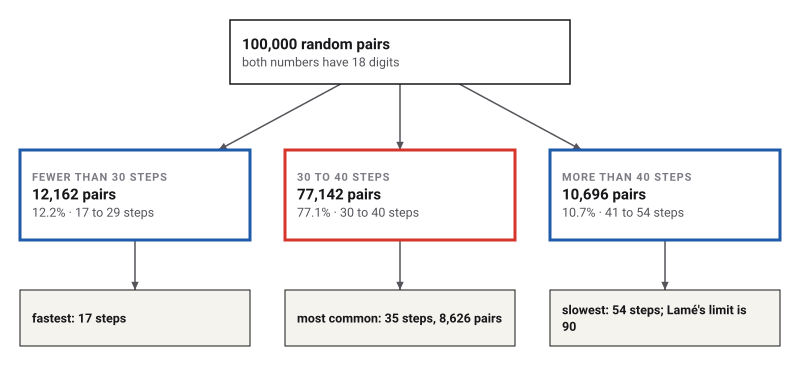

# Euclid's Algorithm

*Era 1 · topic 7 · c. 300 BCE* · [Era 1 index](../README.md) · [← Counting Boards](../06-counting-boards/README.md) · [Archimedes Squeezes Pi →](../08-archimedes-pi/README.md) · [Interactive edition](euclids-algorithm.html) · [Program](../../../code/era-01-the-first-algorithms/07-euclids-algorithm/)

> **Field note from the visiting historian.** Earlier procedures computed a value. This one stops on its own and is proved to work for every pair of numbers. Twenty-three centuries later it still runs, in spirit unchanged, inside every encryption library.

| | |
|---|---|
| **When** | c. 300 BCE (earlier origins: **conjecture**) |
| **Where** | Alexandria · *Elements*, Book VII, Props. 1–2 (**documented**) |
| **What hurt** | Finding a common measure meant trying every candidate |
| **The fix** | Replace (a, b) by (b, a mod b) until the remainder is 0 |
| **Cost** | At most 5 × the digits of the smaller number (Lamé, 1844) |
| **Atlas** | Ch. 4 The Euclidean Algorithm · Ch. 92 Number Theory |

## How ideas combined

A new algorithm is usually an older idea combined with a new one. This is the map of the topic: where Euclid's algorithm came from, and what grew out of it. Each box names the idea that was added.

<picture>
  <source media="(prefers-color-scheme: dark)" srcset="assets/family-dark.svg">
  
</picture>
*Red: the algorithm and its best-known descendants. Blue: the mathematical steps in between. The dashed line is a relationship rather than a descendant: Euclid's quotients are exactly the terms of a continued fraction.*

## Two numbers are the sides of a rectangle

Cut off the biggest square that fits, as many times as it fits, then do the same to the piece that is left. When a piece is filled exactly, the side of its squares is the greatest common divisor.

<picture>
  <source media="(prefers-color-scheme: dark)" srcset="assets/euclid-squares-dark.svg">
  
</picture>
*In the interactive edition you can type your own numbers and cut them stage by stage.*

The number of squares cut at each stage, **2, 3, 7**, is also the continued fraction 1071/462 = [2; 3, 7]. Every Euclid computation hides one.

## Era 1, the first algorithms

<picture>
  <source media="(prefers-color-scheme: dark)" srcset="assets/era-timeline-dark.svg">
  
</picture>

## Each fix leaves a new pain

<picture>
  <source media="(prefers-color-scheme: dark)" srcset="assets/chain-dark.svg">
  
</picture>
*Read it as a snake: each new problem sits directly under the fix that exposed it.*

## 1071 and 462, by hand

| Step | Division | Quotient (squares cut) | Remainder |
|---|---|---|---|
| 1 | 1,071 = 2 × 462 + 147 | 2 | 147 |
| **2** | **462 = 3 × 147 + 21** | **3** | **21** |
| 3 | 147 = 7 × 21 + 0 | 7 | 0 |

The last non-zero remainder, **21**, is gcd(1071, 462). Euclid himself drew numbers as line segments and measured one off along the other:

<picture>
  <source media="(prefers-color-scheme: dark)" srcset="assets/segments-dark.svg">
  
</picture>
*Drawn for this book in the style of Euclid's Elements, not copied from a manuscript.*

> **Wrong turn.** Euclid subtracted one copy at a time. That is fine for 1071 and 462 (12 subtractions), but 1,000,000 and 1 need **1,000,000 subtractions** where one division is enough. Division is subtraction done in bulk.

**Going backwards: the pulverizer.** Run the steps in reverse and every remainder becomes a combination of the two starting numbers. Each row keeps the promise *remainder = s × 1071 + t × 462*. Aryabhata (499 CE) called the method *kuttaka*, "pulverizing", because the numbers get smaller with every step.

| Row | Quotient | Remainder | s | t | Check |
|---|---|---|---|---|---|
| 0 | — | 1,071 | 1 | 0 | 1 × 1071 + 0 × 462 = 1,071 |
| 1 | — | 462 | 0 | 1 | 0 × 1071 + 1 × 462 = 462 |
| 2 | 2 | 147 | 1 | -2 | 1 × 1071 − 2 × 462 = 147 |
| **3** | **3** | **21** | **-3** | **7** | **-3 × 1071 + 7 × 462 = 21** |
| 4 | 7 | 0 | 22 | -51 | 22 × 1071 − 51 × 462 = 0 |

> **Key idea.** **21 = -3 × 1071 + 7 × 462** (Bézout's identity). When the gcd is 1, the s column gives the inverse of one number modulo the other, which is how RSA key generation finds its matching exponent: 17 × 2,753 = 1 (mod 3,120).

## Four ways to find a gcd

Each method keeps the goal and changes one thing. The counts of basic operations come from the program.

<picture>
  <source media="(prefers-color-scheme: dark)" srcset="assets/four-dark.svg">
  
</picture>

| Pair | gcd | Trying every candidate | Subtracting (Euclid) | Dividing | Binary (Stein) |
|---|---|---|---|---|---|
| 1,071 and 462 (the worked example) | 21 | 442 | 12 | **3** | 5 |
| 89 and 55 (consecutive Fibonacci numbers) | 1 | 55 | 10 | **9** | 5 |
| 1,000,000 and 1 (a huge and a tiny number) | 1 | 1 | 1,000,000 | **1** | 7 |
| 2,971,215,073 and 1,836,311,903 (10-digit consecutive Fibonacci numbers) | 1 | 1,836,311,903 | 46 | **45** | 26 |
| 917,151,100,147,030,119 and 740,488,968,177,717,441 (a random 18-digit pair) | 3 | 740,488,968,177,717,439 | 267 | **41** | 45 |

## How fast is it?

**The worst case.** Consecutive Fibonacci numbers make the algorithm work hardest: almost every quotient is 1, so each step takes away as little as possible.

<picture>
  <source media="(prefers-color-scheme: dark)" srcset="assets/ladder-dark.svg">
  
</picture>

Lamé proved in 1844 that the steps never exceed five times the number of digits of the smaller number. The worst cases sit exactly at that limit for small numbers and just below it after that.

<picture>
  <source media="(prefers-color-scheme: dark)" srcset="assets/lame-dark.svg">
  
</picture>

**The average.** Random numbers are much kinder. Each extra digit adds about two steps, as Heilbronn's formula predicts.

<picture>
  <source media="(prefers-color-scheme: dark)" srcset="assets/growth-dark.svg">
  
</picture>

**The spread.** For random 18-digit pairs the counts bunch tightly around the middle.

<picture>
  <source media="(prefers-color-scheme: dark)" srcset="assets/split-dark.svg">
  
</picture>

<details>
<summary>Show the numbers</summary>

| Digits | Worst-case pair (consecutive Fibonacci) | Steps | Lamé's limit | Average, random pairs |
|---|---|---|---|---|
| 1 | 13 and 8 | 5 | 5 | 2.180 |
| 2 | 144 and 89 | 10 | 10 | 3.982 |
| 3 | 1,597 and 987 | 15 | 15 | 5.882 |
| 4 | 10,946 and 6,765 | 19 | 20 | 7.831 |
| 5 | 121,393 and 75,025 | 24 | 25 | 9.774 |
| 6 | 1,346,269 and 832,040 | 29 | 30 | 11.705 |
| 7 | 14,930,352 and 9,227,465 | 34 | 35 | 13.661 |
| 8 | 102,334,155 and 63,245,986 | 38 | 40 | 15.590 |
| 9 | 1,134,903,170 and 701,408,733 | 43 | 45 | 17.518 |
| 10 | 12,586,269,025 and 7,778,742,049 | 48 | 50 | 19.462 |
| 11 | 139,583,862,445 and 86,267,571,272 | 53 | 55 | 21.410 |
| 12 | 1,548,008,755,920 and 956,722,026,041 | 58 | 60 | 23.355 |
| 13 | 10,610,209,857,723 and 6,557,470,319,842 | 62 | 65 | 25.280 |
| 14 | 117,669,030,460,994 and 72,723,460,248,141 | 67 | 70 | 27.248 |
| 15 | 1,304,969,544,928,657 and 806,515,533,049,393 | 72 | 75 | 29.166 |
| 16 | 14,472,334,024,676,221 and 8,944,394,323,791,464 | 77 | 80 | 31.094 |
| 17 | 160,500,643,816,367,088 and 99,194,853,094,755,497 | 82 | 85 | 33.056 |
| 18 | 1,100,087,778,366,101,931 and 679,891,637,638,612,258 | 86 | 90 | 34.965 |

</details>

## An algorithm from 300 BCE finds weak locks in 2012

> **Full circle.** A team from UC San Diego and the University of Michigan collected the public keys of millions of internet hosts and computed greatest common divisors between them. Keys made with poor randomness can share a prime factor, and a shared factor gives the private key away. They recovered RSA private keys for **0.50% of TLS hosts** and **0.03% of SSH hosts** (Heninger, Durumeric, Wustrow and Halderman, *Mining Your Ps and Qs*, USENIX Security 2012; [factorable.net](https://factorable.net/)).

## Before you read on

<details>
<summary><b>1.</b> Find gcd(48, 18). How many divisions does it take?</summary>

48 = 2 × 18 + 12<br>18 = 1 × 12 + 6<br>12 = 2 × 6 + 0<br>So gcd(48, 18) = **6**, in **3** divisions.
</details>

<details>
<summary><b>2.</b> Why must the algorithm stop?</summary>

Each remainder is smaller than the number it was divided by, so the second number of the pair gets strictly smaller at every step. Whole numbers cannot keep getting smaller forever, so it reaches 0.
</details>

<details>
<summary><b>3.</b> Which pair of numbers below 100 makes it work hardest?</summary>

**(89, 55)**, two consecutive Fibonacci numbers, with **9** divisions. The program checked every pair below 100.
</details>

<details>
<summary><b>4.</b> Write 21 as a combination of 1071 and 462.</summary>

21 = **-3** × 1071 + **7** × 462. Check: -3,213 + 3,234 = 21.
</details>

<details>
<summary><b>5.</b> Is gcd(1,000,000, 1) faster by subtraction or by division?</summary>

Division: **1** step against **1,000,000** subtractions.
</details>


## Where the evidence lives

| | Object | Where to see it | Licence |
|---|---|---|---|
|  | **The first printed edition**. Printed by Erhard Ratdolt, Venice, 25 May 1482. | [Smithsonian Libraries' digitised copy](https://library.si.edu/digital-library/book/preclarissimusl00eucl) | Photo: Smithsonian Libraries, CC0 (public domain) |
| — | **MS. D'Orville 301, Bodleian Library**. A Byzantine manuscript of the *Elements*, dated 888, written by Stephanos the clerk. | [Catalogue entry and digital facsimile](https://medieval.bodleian.ox.ac.uk/catalog/manuscript_4146) | Drawn placeholder. Most Digital Bodleian images are CC BY-NC 4.0, so the photographs are linked, not copied. |
| — | **P. Oxy. 29, Penn Museum E2748**. A papyrus fragment of Book II, Proposition 5, with its diagram. Dated 200–400 CE by the museum, 75–125 CE by the papyrologist Eric Turner (**disputed**). | [Penn Museum record](https://collections.penn.museum/collections/object/63505) | Drawn placeholder; no image licence is stated, so the photographs are linked. |

## Every link was opened before it was listed

| Level | Link | Why |
|---|---|---|
| Start | [Euclid's Algorithm](https://www.youtube.com/watch?v=6Y3jHHE_hbA) — Numberphile (Sophie Maclean) | The algorithm and its Fibonacci connection |
| Start | [The Euclidean Algorithm (Finding the GCD/GCF)](https://www.youtube.com/watch?v=SR-jmdjzw-Y) — Houston Math Prep | Step-by-step worked examples |
| Start | [Here's looking at Euclid](https://www.youtube.com/watch?v=9O97Xad-iTQ) — Gresham College, Robin Wilson (2004) | Greek mathematics and the *Elements*, with the Euclidean algorithm in context |
| Start | [Euclid's Algorithm](https://www.cut-the-knot.org/blue/Euclid.shtml) — Cut the Knot | gcd(*a*, *b*) = gcd(*b*, *r*) with a worked example, and Bézout's identity |
| Deeper | [Lec 4, MIT 6.042J Mathematics for Computer Science](https://www.youtube.com/watch?v=NuY7szYSXSw) — MIT OpenCourseWare (2010) | GCD, Euclid's algorithm, the Pulverizer (extended Euclid) |
| Deeper | [2.1.2 Euclidean Algorithm](https://www.youtube.com/watch?v=dW0f62lcCLE) — MIT OpenCourseWare (6.042J, 2015) | Short course segment |
| Deeper | [Euclidean Algorithm](https://mathworld.wolfram.com/EuclideanAlgorithm.html) — Wolfram MathWorld | Lamé's bound, Fibonacci worst case, average-case step count |
| Deeper | [Euclid of Alexandria](https://mathshistory.st-andrews.ac.uk/Biographies/Euclid/) — MacTutor | What is (and is not) known about Euclid |
| Scholar | [Introduction to number theory lecture 3: divisibility and Euclid's algorithm](https://www.youtube.com/watch?v=pVKhDtOjji8) — Richard Borcherds (UC Berkeley) | Rigorous treatment; continues in lecture 4 |
| Scholar | [Elements VII.1](https://mathcs.clarku.edu/~djoyce/elements/bookVII/propVII1.html) — David E. Joyce, Clark University | The propositions with commentary and worked examples |
| Scholar | [Origins of the analysis of the Euclidean algorithm](https://www.sciencedirect.com/science/article/pii/S0315086084710317) — Jeffrey Shallit, Historia Mathematica 21 (1994) | Who first bounded the running time |
| Scholar | [Aryabhata I](https://mathshistory.st-andrews.ac.uk/Biographies/Aryabhata_I/) — MacTutor History of Mathematics | The kuttaka and its link to Euclid's algorithm |
| Scholar | [A Method for Obtaining Digital Signatures and Public-Key Cryptosystems](https://people.csail.mit.edu/rivest/Rsapaper.pdf) — Rivest, Shamir and Adleman (1977) | RSA computes its exponents with "a variation of Euclid's algorithm" |

More, with certainty labels and the gaps we could not fill: [Era 1 reference catalog](https://github.com/vij658/AlgorithmEvolutionAtlas/blob/main/book/era-01-the-first-algorithms/reference-catalog.md).

## The program behind every number here

[EuclidsAlgorithm.java](https://github.com/vij658/AlgorithmEvolutionAtlas/blob/main/code/era-01-the-first-algorithms/07-euclids-algorithm/EuclidsAlgorithm.java) makes **1,444,574 checks**: every method against Java's `BigInteger.gcd`, Bézout's identity on 200,000 random pairs, Lamé's bound for every pair below 1,000, and every continued fraction rebuilt exactly. Run it with `java EuclidsAlgorithm.java` (JDK 17 or newer). The heart of it:

```java
/** The modern form: one division does a whole run of subtractions. */
static long gcd(long a, long b) {
    while (b != 0) {
        long r = a % b;                                // what is left after taking b away as often as possible
        a = b;
        b = r;
    }
    return a;
}

/** Rows of the extended algorithm: {quotient, remainder, s, t} with remainder = s*a + t*b on every row. */
static List<long[]> extendedRows(long a, long b) {
    List<long[]> rows = new ArrayList<>();
    long r0 = a, r1 = b, s0 = 1, s1 = 0, t0 = 0, t1 = 1;
    rows.add(new long[]{0, r0, s0, t0});
    rows.add(new long[]{0, r1, s1, t1});
    while (r1 != 0) {
        long q = r0 / r1;
        long r2 = r0 - q * r1, s2 = s0 - q * s1, t2 = t0 - q * t1;
        rows.add(new long[]{q, r2, s2, t2});
        r0 = r1; r1 = r2; s0 = s1; s1 = s2; t0 = t1; t1 = t2;
    }
    return rows;
}
```

