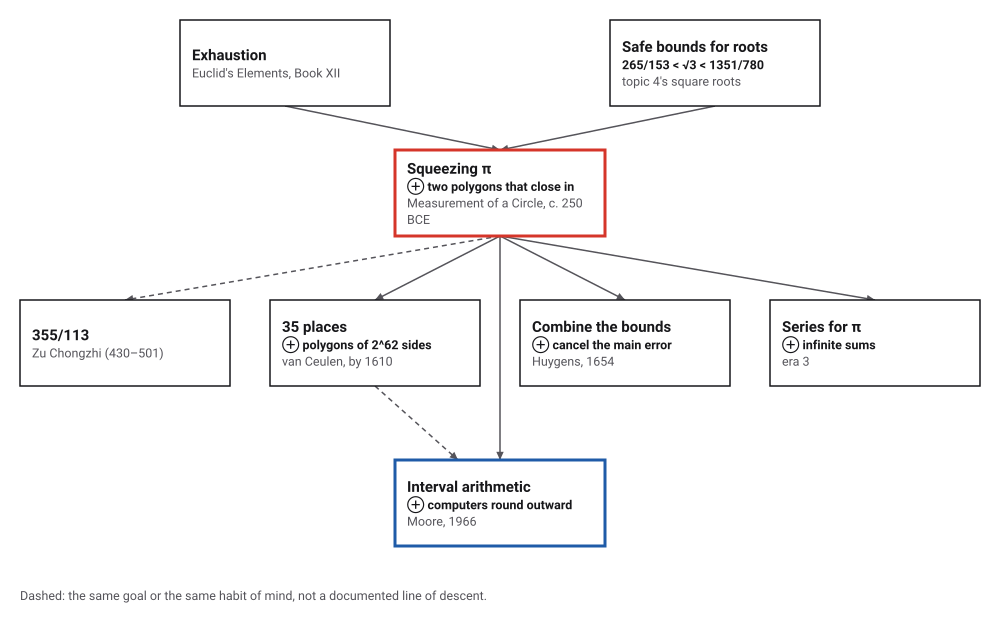
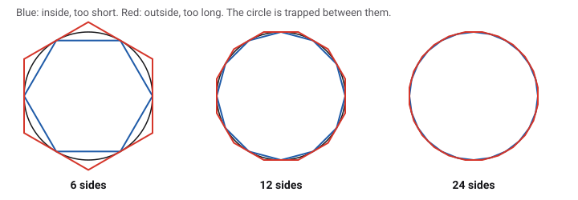
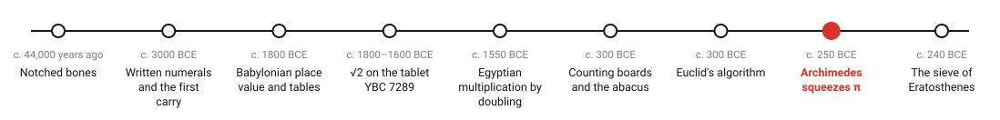
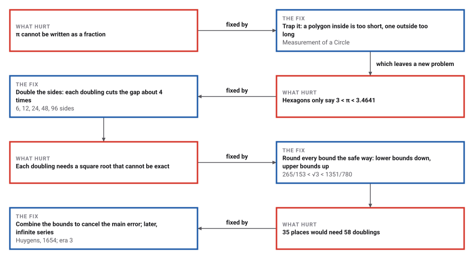
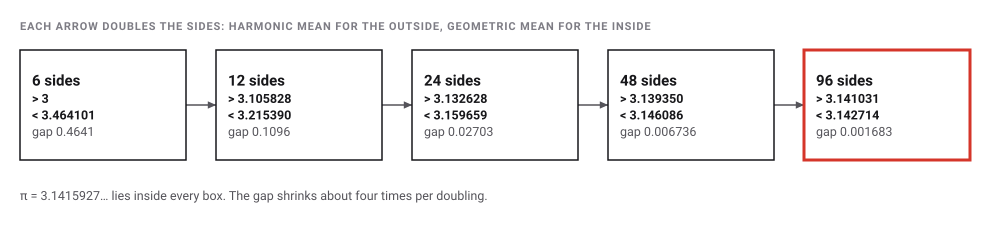
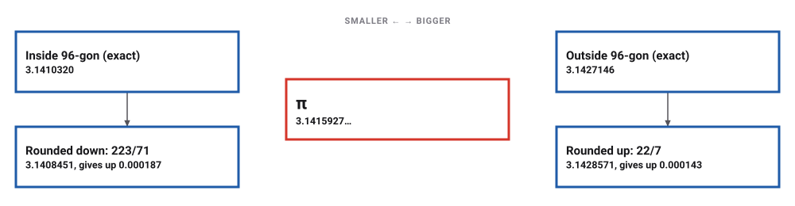

# Archimedes Squeezes Pi

*Era 1 · topic 8 · c. 250 BCE* · [Era 1 index](../README.md) · [← Euclid's Algorithm](../07-euclids-algorithm/README.md) · [The Sieve of Eratosthenes →](../09-sieve-of-eratosthenes/README.md) · [Interactive edition](archimedes-pi.html) · [Program](../../../code/era-01-the-first-algorithms/08-archimedes-pi/)

> **Field note from the visiting historian.** He does not give an answer; he gives an answer with a guaranteed error bound. After 6, 12, 24, 48 and 96 sides: 223/71 < π < 22/7.

| | |
|---|---|
| **When** | Measurement of a Circle, probably c. 250 BCE |
| **Where** | Syracuse, Sicily (**documented**) |
| **What hurt** | A needed quantity that no exact number expresses |
| **The fix** | Two bounds that close in, each step the same formula applied to the last |
| **Cost** | Each doubling cuts the gap about 4 times |
| **Atlas** | Ch. 6.4–6.5 Archimedes and numerical approximation; exhaustion |

## How ideas combined

A new algorithm is usually an older idea combined with a new one. Archimedes combined the method of exhaustion (squeeze a curved figure between straight ones) with safe numerical bounds for square roots, and turned a proof technique into a computation. Each box names the idea that was added.

<picture>
  <source media="(prefers-color-scheme: dark)" srcset="assets/family-dark.svg">
  
</picture>
*Red: Archimedes' squeeze. Blue: the same guarantee built into computers.*

## Trap the circle

A polygon inside a circle is shorter than the circle; a polygon outside is longer. Double the number of sides and both get closer. Archimedes started from hexagons and doubled four times.

<picture>
  <source media="(prefers-color-scheme: dark)" srcset="assets/polygons-dark.svg">
  
</picture>
*In the interactive edition you can double the sides yourself, with a magnified view of the gap.*

## Era 1, the first algorithms

<picture>
  <source media="(prefers-color-scheme: dark)" srcset="assets/era-timeline-dark.svg">
  
</picture>

## Each fix leaves a new pain

<picture>
  <source media="(prefers-color-scheme: dark)" srcset="assets/chain-dark.svg">
  
</picture>
*Read it as a snake: each new problem sits directly under the fix that exposed it.*

## From hexagons to 96 sides

<picture>
  <source media="(prefers-color-scheme: dark)" srcset="assets/ladder-dark.svg">
  
</picture>

| Sides | Inside (too short) | Outside (too long) | Gap | Gap shrank |
|---|---|---|---|---|
| 6 | 3 | 3.464101615 | 0.4641 | — |
| 12 | 3.105828541 | 3.215390309 | 0.1096 | 4.236× |
| 24 | 3.132628613 | 3.159659942 | 0.02703 | 4.053× |
| 48 | 3.139350203 | 3.146086215 | 0.006736 | 4.013× |
| **96** | **3.141031951** | **3.142714600** | **0.001683** | **4.003×** |

Proposition 3 in Heath's translation: "The ratio of the circumference of any circle to its diameter is less than 3 1/7 but greater than 3 10/71."

<picture>
  <source media="(prefers-color-scheme: dark)" srcset="assets/rounding-dark.svg">
  
</picture>

> **Key idea.** Every square root on the way had to be replaced by a fraction, and the fraction had to err on the safe side. For √3 Archimedes used 265/153 < √3 < 1351/780 (1.73202614 < 1.73205081 < 1.73205128). Both are continued-fraction convergents of √3: the best fractions for √3 for their size, which Euclid's algorithm (topic 7) produces. They are the 9th and 12th in the list 1/1, 2/1, 5/3, 7/4, 19/11, 26/15, 71/41, 97/56, 265/153, 362/209, 989/571, 1351/780. He does not say how he found them; reconstructions differ (**disputed**).

## How good is a guaranteed answer?

The program redid the whole computation the way a hand computer must: every intermediate value rounded outward to a fixed number of digits. The bounds always stay valid; they just get looser.

| Digits kept at every step | Bounds at 96 sides | Compared with 223/71 and 22/7 |
|---|---|---|
| 4 | 3.138 < π < 3.145 | looser than Archimedes' bounds |
| 5 | 3.1406 < π < 3.1430 | looser than Archimedes' bounds |
| 6 | 3.14098 < π < 3.14275 | at least as tight as Archimedes' bounds |
| 7 | 3.141015 < π < 3.142717 | at least as tight as Archimedes' bounds |

Rounding blindly needs six digits at every step to be at least as tight as Archimedes' 223/71 and 22/7; at five digits it is looser. To shrink the gap further takes many more doublings. To bring it below 10⁻2: 3 doublings; 10⁻3: 5 doublings; 10⁻10: 17 doublings; 10⁻35: 58 doublings. Ludolph van Ceulen worked out π to 35 places with polygons of 2^62 sides; he died in 1610 and the full result was published in 1621. By this program's count, a gap below 10⁻³⁵ needs 58 doublings from the hexagon, 6 × 2^58 sides.

Combining the bounds helps more than doubling. The 96-gon's inside value is right to 3 places (its error is below 10⁻3); (2 × inside + outside) / 3 gives **6**, and (4 × inside of the 96-gon − inside of the 48-gon) / 3 gives **6**. Huygens found improvements of this kind in 1654; Richardson later made the trick general.

## Computers that round outward

Archimedes did not give *an* answer; he gave an answer with a guaranteed error bound. In 1966 Ramon Moore's book *Interval Analysis* made the same habit into a branch of computing: carry a lower and an upper bound through every step, rounding each the safe way, and the true answer is guaranteed to lie between them.

> **Full circle.** The program's interval run is exactly that: with 6 digits kept it proves 3.14098 < π < 3.14275, no matter how the rounding falls. Calling Archimedes' method the first algorithm with a guaranteed error bound is this book's framing (**conjecture**); MacTutor calls it "the first theoretical calculation" of π.

## Before you read on

<details>
<summary><b>1.</b> Why is the hexagon inside a circle of diameter 1 exactly 3 long?</summary>

Its six sides each equal the radius, 1/2, because the hexagon is made of six equilateral triangles: 6 × 1/2 = 3.
</details>

<details>
<summary><b>2.</b> Is 22/7 bigger or smaller than π? And 223/71?</summary>

22/7 = 3.1428571 is bigger; 223/71 = 3.1408451 is smaller. π = 3.1415927… lies between.
</details>

<details>
<summary><b>3.</b> Why must a lower bound be rounded down?</summary>

If it were rounded up it might pass π, and then it would no longer be a lower bound. Rounding the safe way keeps the guarantee.
</details>

<details>
<summary><b>4.</b> Each doubling shrinks the gap about 4 times. Why 4?</summary>

The error of an n-sided polygon shrinks like 1/n². Doubling n divides it by 2² = 4.
</details>

<details>
<summary><b>5.</b> How many doublings from the hexagon bring the gap below 10⁻¹⁰?</summary>

**17** doublings, a polygon of 6 × 2^17 sides.
</details>


## Where the evidence lives

| | Object | Where to see it | Licence |
|---|---|---|---|
| — | **The Works of Archimedes**. T. L. Heath's English translation (1897), including *Measurement of a Circle*. The surviving treatise is probably a fragment of a longer work (**disputed**). | [Internet Archive scan](https://archive.org/details/worksofarchimede00arch) | Drawn placeholder; the 1897 book is scanned at the link. |

## Every link was opened before it was listed

| Level | Link | Why |
|---|---|---|
| Start | [The Discovery That Transformed Pi](https://www.youtube.com/watch?v=gMlf1ELvRzc) — Veritasium | Opens with Archimedes doubling polygons to 96 sides, then moves to Newton's series |
| Start | [The Story of Pi](https://www.youtube.com/watch?v=f4Sk6gEG570) — Gresham College, Robin Wilson (2007) | Archimedes repeatedly doubling a hexagon's sides, in the long history of π |
| Start | [Approximating Pi](https://www.pbs.org/wgbh/nova/archimedes/pi.html) — PBS NOVA | Illustrated: hexagon to 96-gon |
| Start | [A history of Pi](https://mathshistory.st-andrews.ac.uk/HistTopics/Pi_through_the_ages/) — MacTutor | Archimedes' recursion in the long history of π |
| Deeper | [How Archimedes showed that π is approximately equal to 22/7](https://arxiv.org/pdf/2008.07995) — Damini and Dhar, arXiv | Step-by-step modern reconstruction of the doubling recurrences |
| Deeper | [Ancient estimate of π and modern numerical analysis](https://www.johndcook.com/blog/2023/07/30/archimedes-richardson/) — John D. Cook | From the 96-gon to Huygens and Richardson extrapolation |
| Deeper | [Archimedes on the Circumference and Area of a Circle](https://www.ams.org/publicoutreach/feature-column/fc-2012-02) — AMS Feature Column (Bill Casselman) | The method of exhaustion in Proposition 1 (not the 96-gon) |
| Deeper | [Ludolph van Ceulen](https://mathshistory.st-andrews.ac.uk/Biographies/Van_Ceulen/) — MacTutor | 20 places in 1596 (15 × 2^31 sides); 35 places from polygons of 2^62 sides, published in 1621 after his death in 1610 |
| Scholar | [The Works of Archimedes](https://archive.org/details/worksofarchimede00arch) — T. L. Heath (1897), Internet Archive | The standard English translation, including *Measurement of a Circle* |
| Scholar | [Archimedes' Measurement of a Circle](https://triumphsannals.journals.publicknowledgeproject.org/index.php/triumphsannals/article/download/13291/11763/71303) — TRIUMPHS primary-source project | Students work through the iterations from Heath's text |
| Deeper | [Interval Analysis (review)](https://www.science.org/doi/10.1126/science.158.3799.365) — Science 158 (1967), review of R. E. Moore, Prentice-Hall 1966 | The 1966 book that made guaranteed bounds a branch of computing |

More, with certainty labels and the gaps we could not fill: [Era 1 reference catalog](https://github.com/vij658/AlgorithmEvolutionAtlas/blob/main/book/era-01-the-first-algorithms/reference-catalog.md).

## The program behind every number here

[ArchimedesPi.java](https://github.com/vij658/AlgorithmEvolutionAtlas/blob/main/code/era-01-the-first-algorithms/08-archimedes-pi/ArchimedesPi.java) makes **42 checks**: π between the polygons at every step, Archimedes' fractions outside the exact 96-gon values, his √3 bounds as convergents, and interval runs rounded outward at 4 to 7 digits. Run it with `java ArchimedesPi.java` (JDK 17 or newer). The heart of it:

```java
/** One doubling step: from the outside and inside perimeters of an n-gon (diameter 1) to those of the 2n-gon. */
static BigDecimal[] doubleSides(BigDecimal a, BigDecimal b, MathContext mc) {
    BigDecimal a2 = TWO.multiply(a).multiply(b).divide(a.add(b), mc);   // harmonic mean
    BigDecimal b2 = a2.multiply(b).sqrt(mc);                             // geometric mean
    return new BigDecimal[]{a2, b2};
}
```

