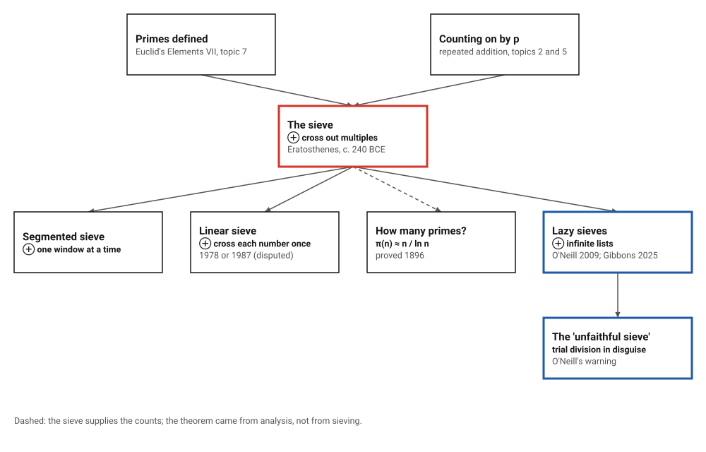
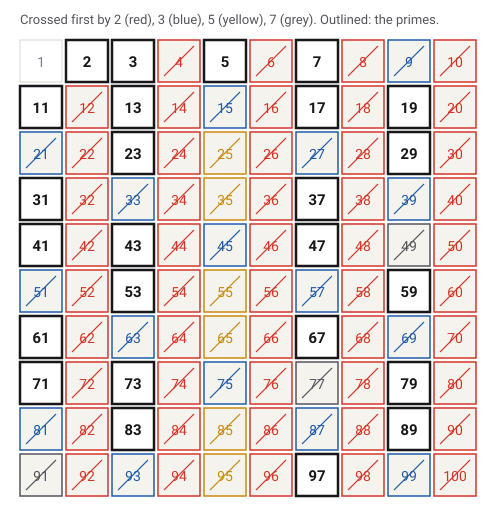
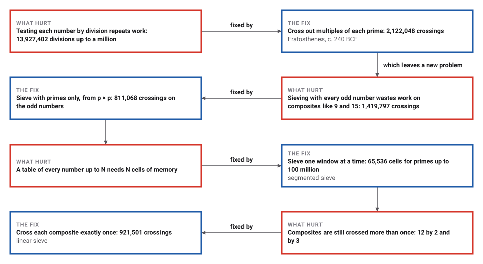
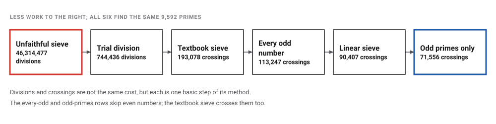

# The Sieve of Eratosthenes

*Era 1 · topic 9 · c. 240 BCE* · [Era 1 index](../README.md) · [← Archimedes Squeezes Pi](../08-archimedes-pi/README.md) · [Interactive edition](sieve-of-eratosthenes.html) · [Program](../../../code/era-01-the-first-algorithms/09-sieve-of-eratosthenes/)

> **Field note from the visiting historian.** Testing each number for divisors repeats the same work again and again. The sieve turns the problem inside out.

| | |
|---|---|
| **When** | Eratosthenes fl. c. 240 BCE; first account by Nicomachus, c. 100 CE |
| **Where** | Alexandria (**documented**); the method's exact origin is unknown |
| **What hurt** | Trial division tests each number from scratch |
| **The fix** | Cross out multiples instead; stop at √n |
| **Cost** | About n ln ln n crossings: 2,122,048 up to a million |
| **Atlas** | Ch. 3 The Sieve of Eratosthenes |

## How ideas combined

A new algorithm is usually an older idea combined with a new one. Euclid's *Elements* defined primes (topic 7); counting on by a fixed step is repeated addition (topics 2 and 5). The sieve turns the question round: instead of asking whether each number is prime, it crosses out what cannot be. Each box names the idea that was added.

<picture>
  <source media="(prefers-color-scheme: dark)" srcset="assets/family-dark.svg">
  
</picture>
*Red: the sieve. Blue: where it is argued about today, in functional programming.*

## Cross out, and see what survives

Take the first number not yet crossed out: it is prime. Cross out its multiples, starting at its square. Repeat until the square passes the end of the table. Switch the sieving numbers to every odd number, as in Nicomachus's account, or start at 2p instead of p × p, and watch the wasted crossings.

<picture>
  <source media="(prefers-color-scheme: dark)" srcset="assets/grid-dark.svg">
  
</picture>
*In the interactive edition you can sieve up to 400, by primes, by every odd number or by every number.*

Up to 100 the sieve makes **104** crossings with just 4 primes: 2, 3, 5 and 7. 11 × 11 = 121 passes 100, so the 25 numbers left are prime.

## Era 1, the first algorithms

<picture>
  <source media="(prefers-color-scheme: dark)" srcset="assets/era-timeline-dark.svg">
  
</picture>

## Each fix leaves a new pain

<picture>
  <source media="(prefers-color-scheme: dark)" srcset="assets/chain-dark.svg">
  
</picture>
*Read it as a snake: each new problem sits directly under the fix that exposed it.*

## A method known from a later book

Eratosthenes of Cyrene (276–194 BCE) was librarian at Alexandria from about 240 BCE (**documented**). None of his writing on the sieve survives. The earliest account is in Nicomachus of Gerasa's *Introduction to Arithmetic*, about 100 CE, three centuries later, and it sieves with odd numbers rather than only with primes. So "c. 240 BCE" dates the man, not the method.

> **Key idea.** The sieve trades memory for time: it keeps a table of every number, and in return never divides. The reciprocal tables of topic 3 made the same trade as a reference book, worked out once and copied; here the table is working memory, built and used inside one computation.

## How much work?

<picture>
  <source media="(prefers-color-scheme: dark)" srcset="assets/methods-dark.svg">
  
</picture>

| Up to | Primes | Trial division | Unfaithful sieve | Every odd number | Odd primes only | Textbook sieve | Linear sieve | n ln ln n |
|---|---|---|---|---|---|---|---|---|
| 100 | 25 | 181 | 411 | 30 | 28 | 104 | 74 | 153 |
| 10,000 | 1,229 | 43,753 | 776,631 | 8,463 | 5,995 | 16,981 | 8,770 | 22,203 |
| 100,000 | 9,592 | 744,436 | 46,314,477 | 113,247 | 71,556 | 193,078 | 90,407 | 244,347 |
| 1,000,000 | 78,498 | 13,927,402 | — | 1,419,797 | 811,068 | 2,122,048 | 921,501 | 2,625,792 |
| 10,000,000 | 664,579 | 286,144,938 | — | 17,074,329 | 8,925,144 | 22,850,051 | 9,335,420 | 27,799,426 |

The textbook sieve's crossings stay below n ln ln n, the classic estimate, at every size. The program also counted **5,761,455** primes up to 100 million with a segmented sieve, holding only 1,229 sieving primes and a window of 65,536 numbers in memory.

Up to 10 million, the largest gap between consecutive primes is 154, after 4,652,353; there are 58,980 pairs of twin primes (primes 2 apart).

## The sieve that was not a sieve

Functional programming has a famous one-line "sieve": take the first number, then filter every later number that it divides, and repeat. In 2009 Melissa O'Neill showed in the *Journal of Functional Programming* that this is really trial division, and far slower than the real thing: it tests each number against every earlier prime instead of crossing out multiples. In 2025 Jeremy Gibbons returned to lazy sieves in the same journal.

> **Full circle.** Up to 100,000 the program counts **46,314,477** divisions for the one-line version against 193,078 crossings for the sieve, about 239 times the work. An algorithm from about 240 BCE was still being argued over in a journal in 2025.

## Before you read on

<details>
<summary><b>1.</b> Why can the sieve stop at 7 when listing primes up to 100?</summary>

Any composite up to 100 has a prime factor at most √100 = 10. The primes up to 10 are 2, 3, 5, 7, so after them nothing composite is left.
</details>

<details>
<summary><b>2.</b> Why start crossing out the multiples of 7 at 49?</summary>

14, 21, 28, 35 and 42 have smaller prime factors (2, 3, 5), so they were crossed out already. The first multiple of 7 with no smaller factor is 7 × 7.
</details>

<details>
<summary><b>3.</b> Sieving with 9 as well as the primes: does it change the answer?</summary>

No: every multiple of 9 is a multiple of 3 and is already crossed out. It only adds work, as the every-odd-number column shows.
</details>

<details>
<summary><b>4.</b> How many primes are there below 1,000,000? And what does n / ln n estimate?</summary>

**78,498**; n / ln n gives about 72,382, an underestimate of about 8%.
</details>

<details>
<summary><b>5.</b> Why is the one-line functional 'sieve' slow?</summary>

It divides each number by every earlier prime until one divides it, with no square-root stop: 46,314,477 divisions up to 100,000.
</details>


## Where the evidence lives

| | Object | Where to see it | Licence |
|---|---|---|---|
| — | **Introduction to Arithmetic**. Nicomachus of Gerasa, about 100 CE, Book I, Chapter 13: the earliest surviving account of the sieve. D'Ooge's English translation, 1926. | [Internet Archive scan](https://archive.org/details/nicomachus-introduction-to-arithmetic) | Drawn placeholder. |

## Every link was opened before it was listed

| Level | Link | Why |
|---|---|---|
| Start | [Sieve of Eratosthenes](https://www.youtube.com/watch?v=klcIklsWzrY) — Khan Academy (Journey into cryptography) | Animated introduction, framed by cryptography |
| Start | [Prime-time mathematics](https://www.youtube.com/watch?v=heY6nsELLVk) — Gresham College, Robin Wilson (2005) | Walks through sifting the numbers up to 100 |
| Start | [Sieve of Eratosthenes](https://mathworld.wolfram.com/SieveofEratosthenes.html) — Wolfram MathWorld | The procedure, and how Nicomachus preserved it |
| Deeper | [Infinite Data Structures: To Infinity & Beyond!](https://www.youtube.com/watch?v=bnRNiE_OVWA) — Computerphile (Graham Hutton) | An infinite list of primes in Haskell: the classic "sieve" that O'Neill's paper critiques |
| Deeper | [Sieve of Eratosthenes](https://cp-algorithms.com/algebra/sieve-of-eratosthenes.html) — CP-Algorithms | Proof of *n* log log *n*, the segmented sieve, block-size advice |
| Deeper | [Eratosthenes of Cyrene](https://mathshistory.st-andrews.ac.uk/Biographies/Eratosthenes/) — MacTutor | Life and work. Note: it credits the account to "Nicomedes", a slip for Nicomachus |
| Scholar | [Turner, Bird, Eratosthenes: an eternal burning thread](https://www.cambridge.org/core/journals/journal-of-functional-programming/article/turner-bird-eratosthenes-an-eternal-burning-thread/32E2EDF5D5EAEC95F13D313BC97B86F0) — Jeremy Gibbons, J. Functional Programming 35 (2025) | A follow-up to O'Neill on lazy sieves |
| Scholar | [Introduction to Arithmetic](https://archive.org/details/nicomachus-introduction-to-arithmetic) — Nicomachus, trans. D'Ooge (1926), Internet Archive | The earliest surviving account (Book I, Ch. 13). Also on Zenodo |
| Scholar | [The Genuine Sieve of Eratosthenes](https://www.cs.hmc.edu/~oneill/papers/Sieve-JFP.pdf) — Melissa O'Neill, J. Functional Programming 19 (2009) | Author's PDF; cite JFP 19(1):95–106 |

More, with certainty labels and the gaps we could not fill: [Era 1 reference catalog](https://github.com/vij658/AlgorithmEvolutionAtlas/blob/main/book/era-01-the-first-algorithms/reference-catalog.md).

## The program behind every number here

[SieveOfEratosthenes.java](https://github.com/vij658/AlgorithmEvolutionAtlas/blob/main/code/era-01-the-first-algorithms/09-sieve-of-eratosthenes/SieveOfEratosthenes.java) makes **40 checks**: six methods agreeing on the primes up to 10 million, the known prime counts up to 10⁸, the linear sieve crossing each composite exactly once, and the segmented sieve against the plain one. Run it with `java SieveOfEratosthenes.java` (JDK 17 or newer). The heart of it:

```java
/** The sieve: cross out multiples of each prime p, starting at p x p, while p x p <= n. */
static boolean[] sieve(int n) {
    boolean[] composite = new boolean[n + 1];
    work = 0;
    for (int p = 2; (long) p * p <= n; p++) {
        if (composite[p]) continue;                                 // only primes do the crossing
        for (int m = p * p; m <= n; m += p) {                       // counting on by p: repeated addition
            composite[m] = true;
            work++;
        }
    }
    return composite;
}
```

