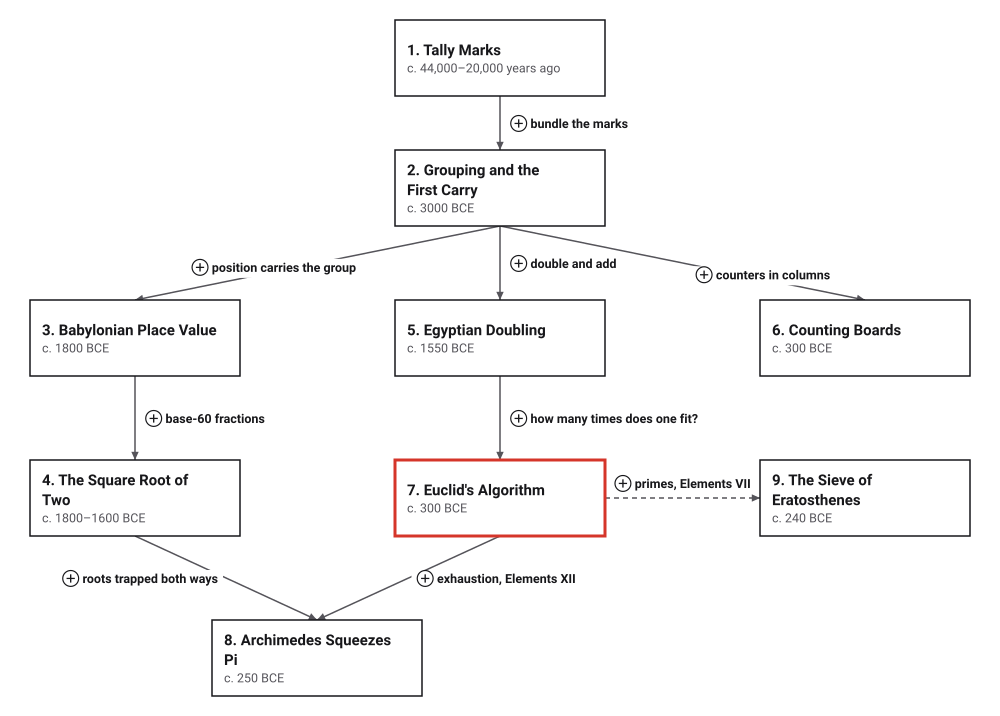

# Era 1 — The First Algorithms

*c. 44,000 years ago to c. 240 BCE* · [Book contents](../README.md) · [Interactive edition](index.html) · [Reference catalog](reference-catalog.md) · [Programs](../../code/era-01-the-first-algorithms/README.md)

> **Field note from the visiting historian.** Before writing, people cut notches in bone. By the time they built libraries, they had written down procedures that work for any number.

## When

<picture>
  <source media="(prefers-color-scheme: dark)" srcset="assets/era-timeline-dark.svg">
  
</picture>

## How the ideas combined

<picture>
  <source media="(prefers-color-scheme: dark)" srcset="assets/era-map-dark.svg">
  
</picture>

*An arrow means the later development reuses the earlier idea. It does not claim one culture learned it from another; where a borrowing is documented, the topic page says so. The dashed arrow is a shared source (Euclid's Elements), not a shared procedure.*

## The topics

| # | Topic | When | What hurt | Read |
|---|---|---|---|---|
| 1 | **Tally Marks** | c. 44,000–20,000 years ago | Remembering *how many* without words for big numbers | [page](01-tally-marks/README.md) · [interactive](01-tally-marks/tally-marks.html) · [program](../../code/era-01-the-first-algorithms/01-tally-marks/README.md) |
| 2 | **Grouping and the First Carry** | Tokens from c. 7500 BCE; numerals c. 3200–3000 BCE | Long rows of marks are slow to write and impossible to read at a glance | [page](02-grouping-and-the-first-carry/README.md) · [interactive](02-grouping-and-the-first-carry/grouping-and-the-first-carry.html) · [program](../../code/era-01-the-first-algorithms/02-grouping-and-the-first-carry/README.md) |
| 3 | **Babylonian Place Value** | Place value c. 2100 BCE; school tables c. 1800 BCE | Additive numerals make multiplication and division painful | [page](03-babylonian-place-value/README.md) · [interactive](03-babylonian-place-value/babylonian-place-value.html) · [program](../../code/era-01-the-first-algorithms/03-babylonian-place-value/README.md) |
| 4 | **The Square Root of Two** | c. 1800–1600 BCE | Some lengths cannot be measured exactly, so they must be computed | [page](04-square-root-of-two/README.md) · [interactive](04-square-root-of-two/square-root-of-two.html) · [program](../../code/era-01-the-first-algorithms/04-square-root-of-two/README.md) |
| 5 | **Egyptian Doubling** | Rhind papyrus c. 1550 BCE, copied from an older text | Multiplying without a times table | planned · [references](reference-catalog.md#5-egyptian-multiplication-by-doubling) |
| 6 | **Counting Boards** | Salamis tablet c. 300 BCE; Exchequer table by 1110 CE | Fast, error-resistant reckoning with movable counters | planned · [references](reference-catalog.md#6-the-counting-board-and-the-abacus) |
| 7 | **Euclid's Algorithm** | Elements Book VII, c. 300 BCE | Finding the greatest common measure without trying every candidate | [page](07-euclids-algorithm/README.md) · [interactive](07-euclids-algorithm/euclids-algorithm.html) · [program](../../code/era-01-the-first-algorithms/07-euclids-algorithm/README.md) |
| 8 | **Archimedes Squeezes Pi** | c. 250 BCE | A quantity that can never be written exactly, but can be trapped | planned · [references](reference-catalog.md#8-archimedes-squeezes-π) |
| 9 | **The Sieve of Eratosthenes** | c. 240 BCE, recorded c. 100 CE | Listing primes without testing each number by division | planned · [references](reference-catalog.md#9-the-sieve-of-eratosthenes) |

The interactive edition is a single HTML file per topic: download it and open it in a browser, or use the published copy linked from the [book contents](../README.md).
